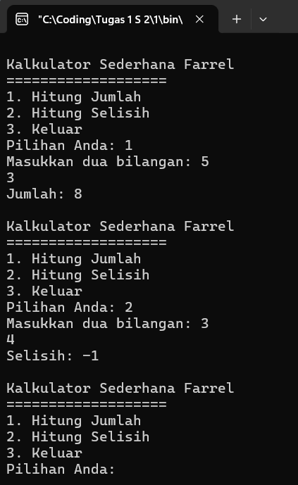
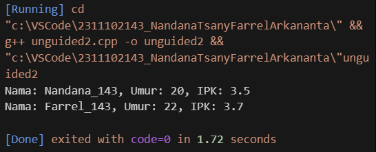
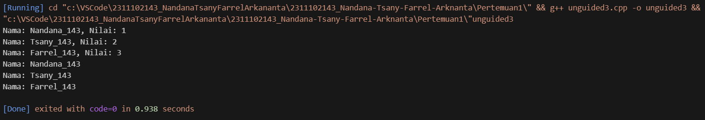

# <h1 align="center">Laporan Praktikum Modul Tipe Data</h1>
<p align="center">Nandana Tsany Farrel Arkananta - 2311102143</p>

## Dasar Teori

Tipe data adalah adalah sebuah pengklasifikasian data berdasarkan jenis data tersebut. Tipe data dibutuhkan agar kompiler dapat mengetahui bagaimana sebuah data akan digunakan. Adapun tipe data yang akan dipelajari, sebagai berikut :

   1. Tipe data Primitif
   2. Tipe data Abstrak
   3. Tipe data Koleksi

### Tipe data Primitif

 Tipe data primitif adalah tipe data yang sudah ditentukan oleh sistem, tipe data primitif ini disediakan oleh banyak bahasa pemrograman, perbedaannya terletak pada jumlah bit yang dialokasikan untuk setiap bit pada tipe data primitif tergantung pada bahasa pemrograman,compiler dan sistem operasinya. Contoh tipe data primitif adalah : a. Int : adalah tipe data yang digunakan untuk menyimpan bilangan bulat seperti 12, 1, 4, dan sebagainya. b. Float : tipe data yang digunakan untuk menyimpan bilangan desimal seperti 1.5, 2.1, 3.14, dan sebagainya. c. Char : berfungsi untuk menyimpan data berupa sebuah huruf. Biasanya digunakan untuk simbol seperti A, B, C dan seterusnya d. Boolean : tipe data ini digunakan untuk menyimpan nilai boolean yang hanya memiliki dua nilai yaitu true dan false.

### Tipe Data Abstrak

Tipe data abstrak atau yang biasa disebut Abstrak Data Tipe(ADT) merupakan tipe data yang dibentuk oleh programer itu sendiri. Pada tipe data abstrak bisa berisi banyak tipe data, jadi nilainya bisa lebih dari satu dan beragam tipe data. Fitur Class adalah fitur Object Oriented Program(OOP) pada bahasa C++ yang mirip dengan fitur data structures Struct pada bahasa C. Keduanya berfungsi untuk membungkus tipe data di dalamnya sebagai anggota. menurut learn.microsoft.com perbedaan antaraPraktikum Struktur Data dan Algoritma 2 Struct dan Class adalah pada akses defaultnya dimana Struct bersifat public dan Class bersifat private.

### Tipe Data Koleksi

Tipe data koleksi (Collection Data Type) adalah tipe data yang digunakan untuk mengelompokkan dan menyimpan beberapa nilai atau objek secara bersamaan. Tipe data koleksi memungkinkan Anda menyimpan, mengelola, dan mengakses sejumlah besar data dengan cara yang terstruktur. Ada beberapa tipe data koleksi yang umum digunakan dalam pemrograman, dan di antaranya adalah:

#### a. Array : Array adalah struktur data statis yang menyimpan elemen-elemen dengan
tipe data yang sama. Elemen-elemen tersebut dapat diakses dengan menggunakan indeks. Array memiliki ukuran tetap yang ditentukan saat deklarasi.

#### b. Vector : Vector adalah Standard Template Library (STL) jika di dalam C/C++
memiliki bentuk std::vector . Umumnya, vector mirip seperti array yang memiliki kemampuan untuk menyimpan data dalam bentuk elemen-elemen yang alokasi memorinya dilakukan otomatis dan bersebelahan. Kemampuan vector bukan hanya pada jumlah elemen yang dinamis, vector pada C/C++ juga dilengkapi dengan fitur-fitur pelengkap seperti element access, iterators, capacity, modifiers

#### c. Map : Map terasa mirip dengan array namun dengan index yang memungkinkan
untuk berupa tipe data selain integer. Pada map, indeks tersebut diberi nama “key”. Pada std::map digunakan Self-Balancing Tree khususnya Red-Black Tree


## Guided 

### 1. Tipe Data Primitif

```C++
#include <iostream>
#include <iomanip>

using namespace std;

 // Tipe Data Primitif Farrel
int main(){
    char op;
    float num1, num2;

    cout<< "Enter operator (+,-,*, /)";
    cin>>op;

    cout<<"enter two operands : ";
    cin>>num1>>num2;

    switch (op)
    {
    case '+':
        cout<<"Result : "<<num1+num2;
        break;
    case '-':
        cout<<"Result : "<<num1-num2;
        break;
    case '*':
        cout<<"Result : "<<num1*num2;
        break;
    case '/':
        if(num2 != 0){
            cout<<"Result: "<<fixed<<setprecision(2)<<num1/num2;
        }else{
            cout<<"Error! Division by zero is not allowed.";
        }
        break;
    
    default:
        cout<<"Error! operator is not correct";
    }
    return 0;
}
```
Kode di atas adalah program untuk melakukan operasi aritmatika dasar (penjumlahan, pengurangan, perkalian, dan pembagian) berdasarkan operator yang dimasukkan pengguna. Akan aktif ketika pengguna sudah menginput dua angka.

### 2. Tipe Data Abstrak

```C++
#include <stdio.h>
#include <string.h>

// Struct
struct Mahasiswa
{
    char name[50];
    char address[50];
    int age;
};

// Tipe Data Abstrak Farrel

int main() {
    // Menggunakan Struct
    struct Mahasiswa mhs1, mhs2;

    // Mengisi nilai ke struct
    strcpy(mhs1.name, "Dian");
    strcpy(mhs1.address, "Mataram");
    mhs1.age = 22;
    strcpy(mhs2.name, "Bambang");
    strcpy(mhs2.address, "Surabaya");
    mhs2.age = 23;

    // Mencetak isi dari struct
    printf("## Mahasiswa 1 ##\n");
    printf("Nama: %s\n", mhs1.name);
    printf("Alamat: %s\n", mhs1.address);
    printf("Umur: %d\n", mhs1.age);
    printf("\n");
    printf("## Mahasiswa 2 ##\n");
    printf("Nama: %s\n", mhs2.name);
    printf("Alamat: %s\n", mhs2.address);
    printf("Umur: %d\n", mhs2.age);

    return 0;
}
```
Program diatas merupakan program yang menggunakan struct untuk mencetak data mahasiswa. Struct 'Mahasiswa' memiliki cabang 'name' (nama), 'address'(alamat),
dan 'age' (umur). Ada dua variabel struct 'mhs1' dan 'mhs2' mendeklarasikan dan menginisialisasi dengan data mahasiswa, dan fungsi 'printf' mencetak informasi mahasiswa.

### 3. Tipe Data Koleksi

```C++
#include <iostream>
#include <array>
using namespace std;

// Tipe Data Koleksi Farrel

int main() {
    // Deklarasi dan inisialisasi array
    int nilai[5];
    nilai[0] = 23;
    nilai[1] = 50;
    nilai[2] = 34;
    nilai[3] = 78;
    nilai[4] = 90;

    // Mencetak array dengan tab
    cout << "Isi array pertama : " << nilai[0] << endl;
    cout << "Isi array kedua : " << nilai[1] << endl;
    cout << "Isi array ketiga : " << nilai[2] << endl;
    cout << "Isi array keempat : " << nilai[3] << endl;
    cout << "Isi array kelima : " << nilai[4] << endl;

    return 0;
}
```
Program diatas adalah program sederhana yang menunjukkan penggunaan array, yaitu tipe data koleksi. Program ini mendeklarasikan dan menginisialisasi sebuah array integer bernama 'nilai' dengan lima elemen. Kemudian, program ini menceta nilai setiap elemen yang ada di dalam array menggunakan 'cout'.

## Unguided  

### 1. Buatlah program menggunakan tipe data primitif minimal dua fungsi dan bebas. Menampilkan program, jelaskan program tersebut dan ambil kesimpulan dari materi tipe data primitif!

```C++
#include <iostream>

using namespace std;

// Fungsi untuk menghitung jumlah dua bilangan
int hitungJumlah(int num1_143, int num2_143) {
  return num1_143 + num2_143;
}

// Fungsi untuk menghitung selisih dua bilangan
int hitungSelisih(int num1_143, int num2_143) {
  return num1_143 - num2_143;
}

int main() {
  int num1_143, num2_143, pilihan;

  while (true) {
    cout << "\nKalkulator Sederhana Farrel\n";
    cout << "===================\n";
    cout << "1. Hitung Jumlah\n";
    cout << "2. Hitung Selisih\n";
    cout << "3. Keluar\n";
    cout << "Pilihan Anda: ";
    cin >> pilihan;

    switch (pilihan) {
      case 1:
        cout << "Masukkan dua bilangan: ";
        cin >> num1_143 >> num2_143;
        cout << "Jumlah: " << hitungJumlah(num1_143, num2_143) << ;
        break;
      case 2:
        cout << "Masukkan dua bilangan: ";
        cin >> num1_143 >> num2_143;
        cout << "Selisih: " << hitungSelisih(num1_143, num2_143) << ;
        break;
      case 3:
        return 0;
      default:
        cout << "Pilihan tidak valid. Silakan coba lagi." << ;
    }
  }

  return 0;
}

```
#### Output:

Kode diatas menghasilkan program kalkulator sederhana dengan menggunakan tipe data primer 'int' untuk mewakili dua bilangan. Dengan menggunakan dua fungsi 'hitungJumlah' dan 'hitungSelisih' untuk melakukan operasi pada bilangan-bilangan tersebut.

### 2. Jelaskan fungsi dari class dan struct secara detail dan berikan contoh programnya

```C++
#include <iostream>
#include <string>

using namespace std;

// class Mahasiswa
class Mahasiswa {
  public:
    // atribut
    string nama;
    int umur_143;
    float ipk;

    // method
    void print() {
        cout << "Nama: " << nama << ", Umur: " << umur_143 << ", IPK: " << ipk << endl;
    }
};

// struct Mahasiswa
struct MahasiswaStruct {
    // atribut
    string nama;
    int umur_143;
    float ipk;
};

int main() {
    // membuat objek dari class Mahasiswa
    Mahasiswa mahasiswa1;
    mahasiswa1.nama = "Nandana_143";
    mahasiswa1.umur_143 = 20;
    mahasiswa1.ipk = 3.5;
    mahasiswa1.print();

    // membuat objek dari struct Mahasiswa
    MahasiswaStruct mahasiswa2;
    mahasiswa2.nama = "Farrel_143";
    mahasiswa2.umur_143 = 22;
    mahasiswa2.ipk = 3.7;
    cout << "Nama: " << mahasiswa2.nama << ", Umur: " << mahasiswa2.umur_143 << ", IPK: " << mahasiswa2.ipk << endl;

    return 0;
}
```
#### Output:


   1. Class digunakan untuk mendefinisikan objek yang memiliki data dan fungsi yang terkait dengan data tersebut. Class dapat memiliki access specifier ('public', 'private', dan 'protected'). Access specifier digunakan untuk mengontrol akses ke data dan fungsi di dalam class.
   2. Secara teknis, struct hanyalah class dengan default access specifier yang adalah 'public'. Dapat digunakan mengakses semua atribut dan method dari struct tanpa harus menggunakan operator '.' atau '->'. Namun, dalam praktik umum, struct digunakan untuk mendefinisikan data saja tanpa method, sementara class digunakan untuk mendefinisikan data dan method yang terkait dengan data tersebut.

Program diatas menyediakan cara untuk mengelompokkan data. Perbedaannya terletak pada hak akses default dan keberlanjutan data. Class memiliki hak akses default 'private', sedangkan struct memiliki hak akses default 'public'. Dalam hal ini, keduanya digunakan untuk menyimpan informasi mahasiswa, tetapi class memiliki metode (fungsi) yang terkait dengan objeknya.

### 3. Buat dan jelaskan program menggunakan fungsi map dan jelaskan perbedaan dari array dengan map

```C++
#include <iostream>
#include <map>
#include <array>

using namespace std;

int main() {
    // Deklarasi map dan array
    map<int, string> myMap;
    array<string, 3> myArray;

    // Menambahkan data ke dalam map
    myMap[1] = "Nandana_143";
    myMap[2] = "Tsany_143";
    myMap[3] = "Farrel_143";

    // Menambahkan data ke dalam array
    myArray[0] = "Nandana_143";
    myArray[1] = "Tsany_143";
    myArray[2] = "Farrel_143";

    // Mencetak data dari map
    for (const auto& item : myMap) {
        cout << "Nama: " << item.second << ", Nilai: " << item.first << endl;
    }

    // Mencetak data dari array
    for (const auto& item : myArray) {
        cout << "Nama: " << item << endl;
    }

    return 0;
}
```
#### Output:


Dalam contoh di atas, kita memiliki dua variabel, yaitu myMap yang merupakan sebuah map dan myArray yang merupakan sebuah array. Kedua variabel ini digunakan untuk menyimpan data nama dengan indeks unik.

Dalam map, kunci (key) digunakan sebagai indeks dan nilai (value) digunakan untuk menyimpan data. Dalam contoh di atas, kita menggunakan tipe data integer sebagai kunci dan tipe data string sebagai nilai. Sedangkan dalam array, kita hanya memiliki indeks dan data yang disimpan dalam array.

Perbedaan antara map dan array adalah:

  1. Map memiliki kunci (key) yang unik dan nilai (value) yang dapat diakses menggunakan kunci tersebut. Sedangkan array hanya memiliki indeks yang digunakan untuk mengakses data yang disimpan di dalamnya.
  2. Map memiliki alamat memori yang efisien dan memungkinkan akses cepat ke nilai berdasarkan kunci. Sedangkan array memiliki alamat memori yang kontigu dan data dapat diakses dengan cara melalui indeks.

## Kesimpulan
Pemahaman terhadap tipe data dalam bahasa pemrograman C++ khususnya pada materi modul 1 ini, sangat penting untuk pengelolaan memori yang efisien, menjaga integritas data, dan mengoptimalkan kinerja program. Dengan menentukan ukuran dan susunan variabel, para pemrogram dapat mengelola alokasi memori secara efektif.

## Referensi
[1] A Zein, & ES Eriana. ALGORITMA DAN STRUKTUR DATA Universitas Pamulang Tangerang Selatan – Banten, 2022.