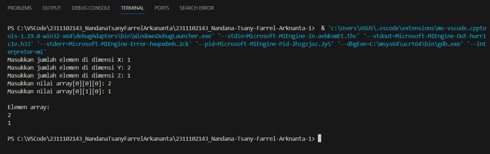

# <h1 align="center">Laporan Praktikum Modul Array</h1>
<p align="center">Nandana Tsany Farrel Arkananta - 2311102143</p>

## Dasar Teori

  Array merupakan struktur data yang paling dasar. Sebelum mempelajari struktur data lainnya, alangkah baiknya, kita perlu mempelajari Array terlebih dahulu. Berikut ini adalah beberapa jenis array :
   1.  Array Satu Dimensi
Array satu dimensi adalah tipe variabel yang terdiri dari kumpulan data dengan tipe yang sama yang disusun dalam satu baris atau satu dimensi. Setiap elemen di dalam array memiliki sebuah indeks atau nomor yang digunakan untuk mengakses elemen tersebut. Indeks dimulai dari 0 dan berakhir pada jumlah elemen dikurangi satu.

    Contohnya, sebuah array satu dimensi 
yang berisi bilangan bulat {1, 2, 3, 4, 5} memiliki lima elemen dan indeksnya dimulai dari 0. Indeks 0 merujuk pada elemen pertama, indeks 1 merujuk pada elemen kedua, dan seterusnya hingga indeks 4 merujuk pada elemen kelima.

  2. Array Dua Dimensi
Array dua dimensi adalah variable yang terdiri dari kumpulan array satu dimensi dengan tipe yang sama yang disusun dalam baris dan kolom. Dalam array dua dimensi, setiap elemen memiliki dua indeks, yaitu indeks baris dan indeks kolom. Indeks baris menunjukkan posisi elemen dalam baris, sementara indeks kolom menunjukkan posisi elemen dalam kolom.

  3. Array Multidimensi
   Array multidimensi memiliki
kesamaan dengan array satu dimensi dan
dua dimensi, namun memiliki kapasitas memori yang lebih besar. Array ini
digunakan untuk merepresentasikan array dengan dimensi lebih dari dua atau
array yang memiliki lebih dari dua indeks, seperti array tiga dimensi, array
empat dimensi, array lima dimensi, dan seterusnya.


## Guided 

### 1. Array Tiga Dimensi

```C++
#include <iostream>
using namespace std;

int main ()
{
      //Deklarasi Array
      int arr[2][3][3];
      //Input elemen
      for (int x = 0; x < 2; x++)
      {
        for (int y = 0; y < 3; y++)
        {
            for (int z = 0; z < 3; z++)
            {
                cout << "Input Array[" << x << "][" << y << "][" <<
z << "] = ";
                cin >> arr[x][y][z];
        }
      }
      cout << endl;
}
// Output Array
    for (int x = 0; x < 2; x++)
      {
        for (int y = 0; y < 3; y++)
          {
            for (int z = 0; z < 3; z++)
          {
            cout << "Data Array[" << x << "][" << y << "][" << z << "] = " << arr[x][y][z] << endl;
     }
   }
}
  cout << endl;
// Tampilan array
    for (int x = 0; x < 2; x++)
      {
        for (int y = 0; y < 3; y++)
          {
            for (int z = 0; z < 3; z++)
     {
      cout << arr[x][y][z] << ends;
     }
      cout << endl;
    }
      cout << endl;
   }
}

```
Program di atas menggunakan array tiga dimensi untuk menyimpan dan menampilkan data. Program meminta pengguna untuk menginput nilai ke dalam array, lalu mencetak nilai yang telah dimasukkan. Selanjutnya, tampilan array disederhanakan dengan mencetak nilai dari setiap elemen array secara berurutan menggunakan perulangan bersarang.

### 2. Mencari Nilai Maksimal Pada Array

```C++
#include <iostream>
using namespace std;

   int main()
 {
   int maks, a, i = 1, lokasi;
      cout << "Masukkan panjang array: ";
      cin >> a;
   int array[a];
      cout << "Masukkan " << a << " angka\n";
          for (i = 0; i < a; i++)
        {
   cout << "Array ke-" << (i) << ": ";
   cin >> array[i];
    }
  maks = array[0];
     for (i = 0; i < a; i++)
   {
if (array[i] > maks)
{
  maks = array[i];
  lokasi = i;
}
  }
    cout << "Nilai maksimum adalah " << maks << " berada di Array ke " << lokasi << endl;
  }

```
Program di atas adalah program yang mencari nilai maksimum dari sejumlah bilangan yang dimasukkan oleh pengguna ke dalam sebuah array. Pengguna diminta untuk memasukkan panjang array dan angka-angkanya. Selanjutnya, program mencari nilai maksimum dengan membandingkan setiap elemen array. Hasilnya dicetak bersama dengan lokasi elemen tersebut dalam array.
========================================================================================================================================

# Unguided

### 1. Buatlah program untuk menampilkan Output seperti berikut dengan data yang diinputkan oleh user!


```C++
// Nandana Tsany Farrel Arkananta-2311102143-S1IF11D

#include <iostream>

using namespace std;

int main() {
    //deklarasi array data dengan 10 elemen 1-10
    int data_143[10] = {1, 2, 3, 4, 5, 6, 7, 8, 9, 10};
    
    cout << "Data array: ";
    for (int i = 0; i < 10; i ++){
        cout << data_143[i] << " ";
    }
    cout << endl << endl;
//menginputkan elemen data nomor genap 
    cout << "nomor genap: ";
    //menampilkan data array elemen nomor genap dari 1-10
    for (int i = 0; i < 10; i++){
        if (data_143 [i] % 2 ==0){
            cout << data_143[i] << " ";
        }
    }
    cout << endl << endl;
//menginputkan elemen data nomor ganjil
    cout << "nomor ganjil: ";
    //menampilkan data array elemen nomor ganjil dari 1-10 menggunakan perulangan for
    for (int i =0; i < 10; i ++){
        if (data_143 [i] %2 !=0){
            cout << data_143[i] << " ";
        }
    }
    cout << endl;
    return 0;
}
```
#### Output:


   
Program di atas adalah program yang menciptakan dan mengelola array data dengan 10 elemen dari 1 hingga 10. 
Cara kerjanya:
1. Program mendeklarasikan array `data` dengan 10 elemen dan menginisialisasinya dengan nilai 1 hingga 10. 
2. Program mencetak isi array tersebut menggunakan perulangan `for`. 
3. Program mencetak elemen-elemen array yang merupakan bilangan genap dengan memeriksa apakah sisa bagi dari setiap elemen terhadap 2 adalah 0.
4. Program mencetak elemen-elemen array yang merupakan bilangan ganjil dengan memeriksa apakah sisa bagi dari setiap elemen terhadap 2 tidak sama dengan 0. Hasilnya, program mencetak bilangan genap dan ganjil secara terpisah.


### 2. Buatlah program Input array tiga dimensi (seperti pada guided) tetapi jumlah atau ukuran elemennya diinputkan oleh user!

```C++
// Nandana Tsany Farrel Arkananta-2311102143-S1IF11D

#include <iostream>

using namespace std;

int main() {
  int x, y, z;

  // Input jumlah elemen di setiap dimensi
  cout << "Masukkan jumlah elemen di dimensi X: ";
  cin >> x;
  cout << "Masukkan jumlah elemen di dimensi Y: ";
  cin >> y;
  cout << "Masukkan jumlah elemen di dimensi Z: ";
  cin >> z;

  // Deklarasi array tiga dimensi
  int array_143[x][y][z];

  // Input nilai elemen array
  for (int i = 0; i < x; i++) {
    for (int j = 0; j < y; j++) {
      for (int k = 0; k < z; k++) {
        cout << "Masukkan nilai array[" << i << "][" << j << "][" << k << "]: ";
        cin >> array_143[i][j][k];
      }
    }
  }

  // Menampilkan elemen array
  cout << endl << "Elemen array:" << endl;
  for (int i = 0; i < x; i++) {
    for (int j = 0; j < y; j++) {
      for (int k = 0; k < z; k++) {
        cout << array_143[i][j][k] << " ";
      }
      cout << endl;
    }
    cout << endl;
  }

  return 0;
}
```
#### Output:


Program tersebut merupakan sebuah program yang meminta pengguna untuk menentukan jumlah elemen dalam setiap dimensi dari array tiga dimensi. 
1. Setelah pengguna memasukkan jumlah elemen untuk setiap dimensi, program membuat array tiga dimensi sesuai dengan jumlah elemen yang dimasukkan. 
2. Pengguna diminta untuk memasukkan nilai untuk setiap elemen dalam array tersebut. Proses ini dilakukan dengan menggunakan tiga perulangan bersarang yang mengiterasi melalui setiap dimensi array. 
3. Setelah semua nilai elemen dimasukkan, program mencetak kembali nilai-nilai elemen array tersebut dengan format yang terstruktur, yaitu setiap elemen dicetak dalam baris yang sesuai dengan dimensi array yang bersangkutan. 
4. Program ini memfasilitasi pengguna untuk dengan mudah memasukkan dan melihat nilai dari array tiga dimensi yang dibuat.

### 3. Buatlah program menu untuk mencari nilai Maksimum, Minimum dan Nilai rata – rata dari suatu array dengan input yang dimasukan oleh user!

```C++
// Nandana Tsany Farrel Arkananta-2311102143-S1IF11D

#include <iostream>

using namespace std;

int main() {
  int n_143;

  // Input jumlah elemen array
  cout << "Masukkan jumlah elemen array: ";
  cin >> n_143;

  // Deklarasi array
  int arr[n_143];

  // Input nilai elemen array
  for (int i = 0; i < n_143; i++) {
    cout << "Masukkan nilai array[" << i << "]: ";
    cin >> arr[i];
  }

  // Mencari nilai maksimum
  int max = arr[0];
  for (int i = 1; i < n_143; i++) {
    if (arr[i] > max) {
      max = arr[i];
    }
  }

  // Mencari nilai minimum
  int min = arr[0];
  for (int i = 1; i < n_143; i++) {
    if (arr[i] < min) {
      min = arr[i];
    }
  }

  // Menghitung nilai rata-rata
  int sum = 0;
  for (int i = 0; i < n_143; i++) {
    sum += arr[i];
  }
  float avg = (float)sum / n_143;

  // Menampilkan hasil
  cout << endl << "Nilai maksimum: " << max << endl;
  cout << "Nilai minimum: " << min << endl;
  cout << "Nilai rata-rata: " << avg << endl;

  return 0;
}
```
#### Output:


Program di atas adalah sebuah program analisis statistik sederhana terhadap sebuah array. 
Cara kerjanya:
1. Pengguna diminta untuk memasukkan jumlah elemen dalam array. 
2. Program membuat array dengan ukuran sesuai dengan jumlah elemen yang dimasukkan. 
3. Pengguna diminta untuk memasukkan nilai untuk setiap elemen dalam array. 
4. Setelah nilai-nilai elemen dimasukkan, program melakukan iterasi melalui array untuk mencari nilai maksimum, nilai minimum, dan menghitung jumlah semua elemen.
5. Nilai maksimum dan minimum dicari dengan membandingkan nilai setiap elemen dengan nilai maksimum atau minimum yang telah ditentukan. 
6. Setelah mendapatkan nilai-nilai tersebut, program menghitung rata-rata dengan menjumlahkan semua elemen dan membaginya dengan jumlah elemen array. 
7. Hasil dari analisis tersebut kemudian dicetak sebagai nilai maksimum, nilai minimum, dan nilai rata-rata dari array tersebut. Dengan demikian, program ini memberikan informasi statistik yang berguna dari array yang dimasukkan oleh pengguna.

========================================================================================================================================

## Kesimpulan
Pada dasarnya, array adalah struktur data yang memungkinkan pengelompokan sejumlah data dalam satu entitas, di mana setiap data memiliki indeks unik untuk referensi. Penggunaan array mempermudah pengelolaan dan akses data, menyediakan kenyamanan dalam organisasi data. Array dibagi menjadi tiga kategori utama: Array Satu Dimensi, yang mengatur data dalam satu baris dengan format Data[], Array Dua Dimensi, yang mengatur data dalam dua baris dengan format Data[][], dan Array Multidimensi, yang mengatur data dalam lebih dari dua dimensi dengan format Data[][][]. Dengan beragam format ini, array memberikan fleksibilitas dalam menyimpan dan memanipulasi data sesuai dengan kebutuhan aplikasi yang berbeda.

## Referensi
[1] A Zein, & ES Eriana. ALGORITMA DAN STRUKTUR DATA Universitas Pamulang Tangerang Selatan – Banten, 2022.
[2] Heybrock, S., Arnold, O., Gudich, I., Nixon, D., & Vaytet, N.. Scipp: Scientific data handling with labeled multi-dimensional arrays for C++ and Python. Journal of Neutron Research, 2020.
[3] MA Pratama. STRUKTUR DATA ARRAY DUA DIMENSI PADA PEMROGRAMAN C++. UNIVERSITAS MITRA INDONESIA Bandar Lampung - Lampung, 2020.