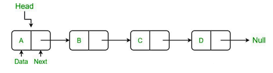
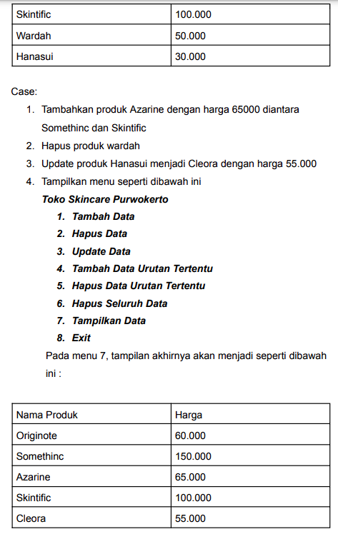
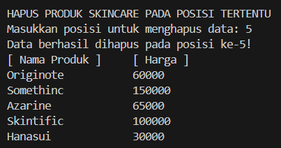

# <h1 align="center">Laporan Praktikum Modul SingleAndDoubleLinkedList</h1>
<p align="center">Nandana Tsany Farrel Arkananta - 2311102143</p>

## Dasar Teori

 #### Single Linked List

Linked List merupakan suatu bentuk struktur data yang berisi kumpulan data
yang disebut sebagai node yang tersusun secara sekuensial, saling sambung
menyambung, dinamis, dan terbatas. Setiap elemen dalam linked list dihubungkan ke elemen lain melalui pointer. Masing-masing komponen sering
disebut dengan simpul atau node atau verteks. Pointer adalah alamat elemen.
Setiap simpul pada dasarnya dibagi atas dua bagian pertama disebut bagian
isi atau informasi atau data yang berisi nilai yang disimpan oleh simpul.
Bagian kedua disebut bagian pointer yang berisi alamat dari node berikutnya
atau sebelumnya. Dengan menggunakan struktur seperti ini, linked list
dibentuk dengan cara menunjuk pointer next suatu elemen ke elemen yang
mengikutinya. Pointer next pada elemen terakhir merupakan NULL, yang
menunjukkan akhir dari suatu list. Elemen pada awal suatu list disebut head
dan elemen terakhir dari suatu list disebut tail.



Dalam operasi Single Linked List, umumnya dilakukan operasi penambahan
dan penghapusan simpul pada awal atau akhir daftar, serta pencarian dan
pengambilan nilai pada simpul tertentu dalam daftar. Karena struktur data ini hanya memerlukan satu pointer untuk setiap simpul, maka Single Linked List umumnya lebih efisien dalam penggunaan memori dibandingkan dengan jenis Linked List lainnya, seperti Double Linked List dan Circular Linked List. Single linked list yang kedua adalah circular linked list. Perbedaan circular linked list dan non circular linked adalah penunjuk next pada node terakhir pada circular linked list akan selalu merujuk ke node pertama.


#### Double Linked List

Double Linked List adalah struktur data Linked List yang mirip dengan Single Linked List, namun dengan tambahan satu pointer tambahan pada setiap
simpul yaitu pointer prev yang menunjuk ke simpul sebelumnya. Dengan
adanya pointer prev, Double Linked List memungkinkan untuk melakukan
operasi penghapusan dan penambahan pada simpul mana saja secara efisien.
Setiap simpul pada Double Linked List memiliki tiga elemen penting, yaitu
elemen data (biasanya berupa nilai), pointer next yang menunjuk ke simpul
berikutnya, dan pointer prev yang menunjuk ke simpul sebelumnya.

Keuntungan dari Double Linked List adalah memungkinkan untuk melakukan
operasi penghapusan dan penambahan pada simpul dimana saja dengan
efisien, sehingga sangat berguna dalam implementasi beberapa algoritma yang
membutuhkan operasi tersebut. Selain itu, Double Linked List juga
memungkinkan kita untuk melakukan traversal pada list baik dari depan
(head) maupun dari belakang (tail) dengan mudah. Namun, kekurangan dari
Double Linked List adalah penggunaan memori yang lebih besar
dibandingkan dengan Single Linked List, karena setiap simpul membutuhkan
satu pointer tambahan. Selain itu, Double Linked List juga membutuhkan
waktu eksekusi yang lebih lama dalam operasi penambahan dan penghapusan
jika dibandingkan dengan Single Linked List.

Representasi sebuah double linked list dapat dilihat pada gambar berikut ini:


Di dalam sebuah linked list, ada 2 pointer yang menjadi penunjuk utama,
yakni pointer HEAD yang menunjuk pada node pertama di dalam linked list
itu sendiri dan pointer TAIL yang menunjuk pada node paling akhir di dalam
linked list. Sebuah linked list dikatakan kosong apabila isi pointer head adalah NULL. Selain itu, nilai pointer prev dari HEAD selalu NULL, karena
merupakan data pertama. Begitu pula dengan pointer next dari TAIL yang
selalu bernilai NULL sebagai penanda data terakhir.

## Guided 

### 1. Single Linked List

```C++
#include <iostream>

using namespace std;

///PROGRAM SINGLE LINKED LIST NON-CIRCULAR
//Deklarasi Struct Node
struct Node {
	int data;
	Node *next;
}

;
Node *head;
Node *tail;

//Inisialisasi Node
void init() {
	head=NULL;
	tail=NULL;
}

// Pengecekan
bool isEmpty() {
	if (head==NULL) return true;
	else return false;
}

//Tambah Depan
void insertDepan(int nilai) {
	//Buat Node baru
	Node *baru=new Node;
	baru->data=nilai;
	baru->next=NULL;

	if (isEmpty()==true) {
		head=tail=baru;
		tail->next=NULL;
	}

	else {
		baru->next=head;
		head=baru;
	}
}

//Tambah Belakang
void insertBelakang(int nilai) {
	//Buat Node baru
	Node *baru=new Node;
	baru->data=nilai;
	baru->next=NULL;

	if (isEmpty()==true) {
		head=tail=baru;
		tail->next=NULL;
	}

	else {
		tail->next=baru;
		tail=baru;
	}
}

//Hitung Jumlah List
int hitungList() {
	Node *hitung;
	hitung=head;
	int jumlah=0;

	while(hitung !=NULL) {
		jumlah++;
		hitung=hitung->next;
	}

	return jumlah;
}

//Tambah Tengah
void insertTengah(int data, int posisi) {
	if(posisi < 1 || posisi > hitungList()) {
		cout << "Posisi diluar jangkauan" << endl;
	}

	else if(posisi==1) {
		cout << "Posisi bukan posisi tengah" << endl;
	}

	else {
		Node *baru,
		*bantu;
		baru=new Node();
		baru->data=data;
		// tranversing
		bantu=head;
		int nomor=1;

		while(nomor < posisi - 1) {
			bantu=bantu->next;
			nomor++;
		}

		baru->next=bantu->next;
		bantu->next=baru;
	}
}

//Hapus Depan
void hapusDepan() {
	Node *hapus;

	if (isEmpty()==false) {
		if (head->next !=NULL) {
			hapus=head;
			head=head->next;
			delete hapus;
		}

		else {
			head=tail=NULL;
		}
	}

	else {
		cout << "List kosong!" << endl;
	}
}

//Hapus Belakang
void hapusBelakang() {
	Node *hapus;
	Node *bantu;

	if (isEmpty()==false) {
		if (head !=tail) {
			hapus=tail;
			bantu=head;

			while (bantu->next !=tail) {
				bantu=bantu->next;
			}

			tail=bantu;
			tail->next=NULL;
			delete hapus;
		}

		else {
			head=tail=NULL;
		}
	}

	else {
		cout << "List kosong!" << endl;
	}
}

//Hapus Tengah
void hapusTengah(int posisi) {
	Node *hapus,
	*bantu,
	*bantu2;

	if(posisi < 1 || posisi > hitungList()) {
		cout << "Posisi di luar jangkauan" << endl;
	}

	else if(posisi==1) {
		cout << "Posisi bukan posisi tengah" << endl;
	}

	else {
		int nomor=1;
		bantu=head;

		while(nomor <=posisi) {
			if(nomor==posisi-1) {
				bantu2=bantu;
			}

			if(nomor==posisi) {
				hapus=bantu;
			}

			bantu=bantu->next;
			nomor++;
		}

		bantu2->next=bantu;
		delete hapus;
	}
}

//Ubah Depan
void ubahDepan(int data) {
	if (isEmpty()==false) {
		head->data=data;
	}

	else {
		cout << "List masih kosong!" << endl;
	}
}

//Ubah Tengah
void ubahTengah(int data, int posisi) {
	Node *bantu;

	if (isEmpty()==false) {
		if(posisi < 1 || posisi > hitungList()) {
			cout << "Posisi di luar jangkauan" << endl;
		}

		else if(posisi==1) {
			cout << "Posisi bukan posisi tengah" << endl;
		}

		else {
			bantu=head;
			int nomor=1;

			while (nomor < posisi) {
				bantu=bantu->next;
				nomor++;
			}

			bantu->data=data;
		}
	}

	else {
		cout << "List masih kosong!" << endl;
	}
}

//Ubah Belakang
void ubahBelakang(int data) {
	if (isEmpty()==false) {
		tail->data=data;
	}

	else {
		cout << "List masih kosong!" << endl;
	}
}

//Hapus List
void clearList() {
	Node *bantu,
	*hapus;
	bantu=head;

	while (bantu !=NULL) {
		hapus=bantu;
		bantu=bantu->next;
		delete hapus;
	}

	head=tail=NULL;
	cout << "List berhasil terhapus!" << endl;
}

//Tampilkan List
void tampil() {
	Node *bantu;
	bantu=head;

	if (isEmpty()==false) {
		while (bantu !=NULL) {
			cout << bantu->data << ends;
			bantu=bantu->next;
		}

		cout << endl;
	}

	else {
		cout << "List masih kosong!" << endl;
	}
}

int main() {
	init();
	insertDepan(3);
	tampil();
	insertBelakang(5);
	tampil();
	insertDepan(2);
	tampil();
	insertDepan(1);
	tampil();
	hapusDepan();
	tampil();
	hapusBelakang();
	tampil();
	insertTengah(7, 2);
	tampil();
	hapusTengah(2);
	tampil();
	ubahDepan(1);
	tampil();
	ubahBelakang(8);
	tampil();
	ubahTengah(11, 2);
	tampil();
	return 0;
}

```
Dalam kode di atas, disusun sebuah program untuk mengelola operasi dasar pada linked list satu arah (non-circular). Digunakan struktur data `Node` dengan anggota `data` untuk menyimpan nilai dan `next` untuk menunjukkan node berikutnya dalam linked list. Fungsi-fungsi seperti `init()`, `isEmpty()`, `insertDepan()`, `insertBelakang()`, `insertTengah()`, `hapusDepan()`, `hapusBelakang()`, `hapusTengah()`, `ubahDepan()`, `ubahBelakang()`, `ubahTengah()`, `clearList()`, dan `tampil()` digunakan untuk melakukan inisialisasi, penambahan, penghapusan, perubahan nilai, pengosongan, dan penampilan isi linked list. Di dalam fungsi `main()`, dilakukan pengujian terhadap berbagai fungsi yang telah didefinisikan, seperti menambah, menghapus, dan mengubah nilai data pada node, serta menampilkan isi linked list.

### 2. Double Linked List

```C++
#include <iostream>
using namespace std;

class Node {
	public: int data;
	Node* prev;
	Node* next;
}

;

class DoubleLinkedList {
	public:
		Node* head;
	Node* tail;

	DoubleLinkedList() {
		head=nullptr;
		tail=nullptr;
	}

	void push(int data) {
		Node* newNode=new Node;
		newNode->data=data;
		newNode->prev=nullptr;
		newNode->next=head;

		if (head !=nullptr) {
			head->prev=newNode;
		}

		else {
			tail=newNode;
		}

		head=newNode;
	}

	void pop() {
		if (head==nullptr) {
			return;
		}

		Node* temp=head;
		head=head->next;

		if (head !=nullptr) {
			head->prev=nullptr;
		}

		else {
			tail=nullptr;
		}

		delete temp;
	}

	bool update(int oldData, int newData) {
		Node* current=head;

		while (current !=nullptr) {
			if (current->data==oldData) {
				current->data=newData;
				return true;
			}

			current=current->next;
		}

		return false;
	}

	void deleteAll() {
		Node* current=head;

		while (current !=nullptr) {
			Node* temp=current;
			current=current->next;
			delete temp;
		}

		head=nullptr;
		tail=nullptr;
	}

	void display() {
		Node* current=head;

		while (current !=nullptr) {
			cout << current->data << " ";
			current=current->next;
		}

		cout << endl;
	}
}

;

int main() {
	DoubleLinkedList list;

	while (true) {
		cout << "1. Add data" << endl;
		cout << "2. Delete data" << endl;
		cout << "3. Update data" << endl;
		cout << "4. Clear data" << endl;
		cout << "5. Display data" << endl;
		cout << "6. Exit" << endl;
		int choice;
		cout << "Enter your choice: ";
		cin>>choice;

		switch (choice) {
			case 1: {
				int data;
				cout << "Enter data to add: ";
				cin>>data;
				list.push(data);
				break;
			}

			case 2: {
				list.pop();
				break;
			}

			case 3: {
				int oldData,
				newData;
				cout << "Enter old data: ";
				cin>>oldData;
				cout << "Enter new data: ";
				cin>>newData;
				bool updated=list.update(oldData,
					newData);

				if ( !updated) {
					cout << "Data not found" << endl;
				}

				break;
			}

			case 4: {
				list.deleteAll();
				break;
			}

			case 5: {
				list.display();
				break;
			}

			case 6: {
				return 0;
			}

			default: {
				cout << "Invalid choice" << endl;
				break;
			}
		}
	}

	return 0;
}

```
Program di atas merupakan implementasi Double Linked List. Double Linked List adalah struktur data yang memungkinkan penyimpanan dan manipulasi data dalam urutan, dimana setiap elemen terhubung dengan elemen sebelumnya dan sesudahnya. Kode ini menggunakan kelas `Node` untuk merepresentasikan setiap elemen, yang menyimpan data serta pointer ke node sebelumnya dan setelahnya. Kelas `DoubleLinkedList` menyediakan fungsi-fungsi dasar seperti penambahan, penghapusan, pembaruan, penghapusan seluruh data, dan penampilan isi linked list. Di dalam fungsi `main()`, pengguna dapat memilih operasi yang diinginkan melalui menu yang ditampilkan di layar. Program akan berjalan terus menerus hingga pengguna memilih untuk keluar.


# Unguided

### 1. Soal mengenai Single Linked List
Buatlah program menu Single Linked List Non-Circular untuk
menyimpan Nama dan usia mahasiswa, dengan menggunakan inputan
dari user. Lakukan operasi berikut:
a. Masukkan data sesuai urutan berikut. (Gunakan insert depan,
belakang atau tengah). Data pertama yang dimasukkan adalah
nama dan usia anda.


```C++
// Nandana Tsany Farrel Arkananta_2311102143_S1IF11D

#include <iostream>
using namespace std;

struct Node {
    string nama_143;
    int usia_143nama_143;
    Node* next_143nama_143;
};

Node* head_143nama_143 = nullptr;

void tampilkanList_143nama_143() {
    cout << "[ Nama ]" << "\t" << "[ Usia ]" << endl;
    Node* saatIni_143nama_143 = head_143nama_143;
    while (saatIni_143nama_143 != nullptr) {
        cout << saatIni_143nama_143->nama_143 << "\t\t" << saatIni_143nama_143->usia_143nama_143 << endl;
        saatIni_143nama_143 = saatIni_143nama_143->next_143nama_143;
    }
}

void insertDepan_143nama_143(string nama_143, int usia_143nama_143) {
    Node* baru_143nama_143 = new Node;
    baru_143nama_143->nama_143 = nama_143;
    baru_143nama_143->usia_143nama_143 = usia_143nama_143;
    baru_143nama_143->next_143nama_143 = head_143nama_143;
    head_143nama_143 = baru_143nama_143;
}

void insertBelakang_143nama_143(string nama_143, int usia_143nama_143) {
    Node* baru_143nama_143 = new Node;
    baru_143nama_143->nama_143 = nama_143;
    baru_143nama_143->usia_143nama_143 = usia_143nama_143;
    baru_143nama_143->next_143nama_143 = nullptr;
    if (head_143nama_143 == nullptr) {
        head_143nama_143 = baru_143nama_143;
    }
    else {
        Node* temp_143nama_143 = head_143nama_143;
        while (temp_143nama_143->next_143nama_143 != nullptr) {
            temp_143nama_143 = temp_143nama_143->next_143nama_143;
        }
        temp_143nama_143->next_143nama_143 = baru_143nama_143;
    }
}

void insertTengah_143nama_143(string nama_143, int usia_143nama_143, int posisi_143nama_143) {
    Node* baru_143nama_143 = new Node;
    baru_143nama_143->nama_143 = nama_143;
    baru_143nama_143->usia_143nama_143 = usia_143nama_143;
    Node* bantu_143nama_143 = head_143nama_143;
    for (int i_143nama_143 = 1; i_143nama_143 < posisi_143nama_143 - 1; i_143nama_143++) {
        if (bantu_143nama_143 != nullptr) {
            bantu_143nama_143 = bantu_143nama_143->next_143nama_143;
        }
    }
    if (bantu_143nama_143 != nullptr) {
        baru_143nama_143->next_143nama_143 = bantu_143nama_143->next_143nama_143;
        bantu_143nama_143->next_143nama_143 = baru_143nama_143;
    }
}

void hapusData_143nama_143(string nama_143) {
    Node* hapus_143nama_143 = head_143nama_143;
    Node* prev_143nama_143 = nullptr;
    while (hapus_143nama_143 != nullptr && hapus_143nama_143->nama_143 != nama_143) {
        prev_143nama_143 = hapus_143nama_143;
        hapus_143nama_143 = hapus_143nama_143->next_143nama_143;
    }
    if (hapus_143nama_143 == nullptr) {
        cout << "Data tidak ditemukan" << endl;
        return;
    }
    if (prev_143nama_143 == nullptr) {
        head_143nama_143 = hapus_143nama_143->next_143nama_143;
    }
    else {
        prev_143nama_143->next_143nama_143 = hapus_143nama_143->next_143nama_143;
    }
    delete hapus_143nama_143;
}

void ubahData_143nama_143(string nama_143, string newnama_143, int newusia_143nama_143) {
    Node* temp_143nama_143 = head_143nama_143;
    while (temp_143nama_143 != nullptr && temp_143nama_143->nama_143 != nama_143) {
        temp_143nama_143 = temp_143nama_143->next_143nama_143;
    }
    if (temp_143nama_143 != nullptr) {
        temp_143nama_143->nama_143 = newnama_143;
        temp_143nama_143->usia_143nama_143 = newusia_143nama_143;
    }
}

void tampilkanData() {
    Node* temp_143nama_143 = head_143nama_143;
    while (temp_143nama_143 != nullptr) {
        cout << temp_143nama_143->nama_143 << " " << temp_143nama_143->usia_143nama_143 << endl;
        temp_143nama_143 = temp_143nama_143->next_143nama_143;
    }
}

int main() {
    insertBelakang_143nama_143("John", 19);
    insertBelakang_143nama_143("Jane", 20);
    insertBelakang_143nama_143("Michael", 18);
    insertBelakang_143nama_143("Yusuke", 19);
    insertBelakang_143nama_143("Akechi", 20);
    insertBelakang_143nama_143("Hoshino", 18);
    insertBelakang_143nama_143("Karin", 18);

    char pilihan_143nama_143;
    do {
        cout << "\nMenu Farrel_143:\n";
        cout << "a. Tampilkan data sesuai urutan tersedia (Data pertama adalah nama dan usia pengguna)\n";
        cout << "b. Hapus data Akechi\n";
        cout << "c. Tambahkan data berikut diantara John dan Jane : Futaba 18\n";
        cout << "d. Tambahkan data berikut diawal : Igor 20\n";
        cout << "e. Ubah data Michael menjadi : Reyn 18\n";
        cout << "f. Tampilkan seluruh data\n";
        cout << "g. Keluar\n";
        cout << "Pilihan Anda: ";
        cin >> pilihan_143nama_143;

        switch (pilihan_143nama_143) {
            case 'a':
                cout << "\nData yang tersedia:\n";
                tampilkanList_143nama_143();
                break;
            case 'b':
                hapusData_143nama_143("Akechi");
                cout << "Data Akechi berhasil dihapus.\n";
                cout << "\nData yang tersedia setelah penghapusan:\n";
                tampilkanList_143nama_143();
                break;
            case 'c':
                insertTengah_143nama_143("Futaba", 18, 3); 
                cout << "Data Futaba berhasil ditambahkan.\n";
                cout << "\nData yang tersedia setelah penambahan:\n";
                tampilkanList_143nama_143();
                break;
            case 'd':
                insertDepan_143nama_143("Igor", 20);
                cout << "Data Igor berhasil ditambahkan di awal.\n";
                cout << "\nData yang tersedia setelah penambahan:\n";
                tampilkanList_143nama_143();
                break;
            case 'e':
                ubahData_143nama_143("Michael", "Reyn", 18);
                cout << "Data Michael berhasil diubah menjadi Reyn 18.\n";
                cout << "\nData yang tersedia setelah perubahan:\n";
                tampilkanList_143nama_143();
                break;
            case 'f':
                cout << "\nTampilan seluruh data sekarang:\n";
                tampilkanList_143nama_143();
                break;
            case 'g':
                cout << "Terima kasih, program selesai.\n";
                break;
            default:
                cout << "Pilihan tidak valid, silakan coba lagi.\n";
                break;
        }
    } while (pilihan_143nama_143 != 'g');

    return 0;
}
```
#### Output:


   
Program di atas merupakan operasi dasar pada sebuah linked list satu arah (single linked list). Dalam program ini, digunakan struktur data `Node` yang memiliki dua elemen, yaitu `nama_143` untuk menyimpan nama dan `usia_143nama_143` untuk usia. Terdapat fungsi-fungsi seperti `tampilkanList_143nama_143()`, `insertDepan_143nama_143()`, `insertBelakang_143nama_143()`, `insertTengah_143nama_143()`, `hapusData_143nama_143()`, `ubahData_143nama_143()`, dan `tampilkanData()` untuk melakukan berbagai operasi seperti menampilkan, menambah, menghapus, dan mengubah data dalam linked list. Dalam `main()`, terdapat menu interaktif yang memungkinkan pengguna untuk memilih operasi yang ingin dilakukan, seperti menampilkan data, menghapus data, menambah data, mengubah data, atau menampilkan seluruh data. Program berjalan dalam loop hingga pengguna memilih untuk keluar.


### 2. Soal mengenai Double Linked List
Modifikasi Guided Double Linked List dilakukan dengan penambahan
operasi untuk menambah data, menghapus, dan update di tengah / di
urutan tertentu yang diminta. Selain itu, buatlah agar tampilannya
menampilkan Nama produk dan harga.




```C++
// Nandana Tsany Farrel Arkananta_2311102143_S1IF11D

#include <iostream>
#include <iomanip> 
using namespace std;

// Deklarasi Struct Node
class Node {
public:
    string produk_143;
    int harga_143;
    Node* prev_143;
    Node* next_143;
};

// Deklarasi Class DoubleLinkedList
class DoubleLinkedList {
public:
    Node* head_143;
    Node* tail_143;

    // Constructor
    DoubleLinkedList() {
        head_143 = nullptr;
        tail_143 = nullptr;
    }

    // Prosedur untuk menambahkan data di depan
    void Push(int harga_143, string produk_143) {
        Node* newNode_143 = new Node;
        newNode_143->harga_143 = harga_143;
        newNode_143->produk_143 = produk_143;
        newNode_143->prev_143 = nullptr;
        newNode_143->next_143 = head_143;

        if (head_143 != nullptr) {
            head_143->prev_143 = newNode_143;
        }
        else {
            tail_143 = newNode_143;
        }

        head_143 = newNode_143;
    }

    // Prosedur untuk menambahkan data pada posisi tertentu
    void PushPosition(int posisi_143, int harga_143, string produk_143) {
        if (posisi_143 < 1) {
            cout << "Posisi tidak valid!" << endl;
            return;
        }

        Node* newNode_143 = new Node;
        newNode_143->harga_143 = harga_143;
        newNode_143->produk_143 = produk_143;
        newNode_143->prev_143 = nullptr;
        newNode_143->next_143 = nullptr;

        if (posisi_143 == 1) {
            newNode_143->next_143 = head_143;
            if (head_143 != nullptr)
                head_143->prev_143 = newNode_143;
            else
                tail_143 = newNode_143;
            head_143 = newNode_143;
            return;
        }

        Node* saatIni_143 = head_143;
        for (int i = 1; i < posisi_143 - 1 && saatIni_143 != nullptr; ++i)
            saatIni_143 = saatIni_143->next_143;

        if (saatIni_143 == nullptr) {
            cout << "Posisi tidak valid!" << endl;
            delete newNode_143;
            return;
        }

        newNode_143->next_143 = saatIni_143->next_143;
        newNode_143->prev_143 = saatIni_143;
        if (saatIni_143->next_143 != nullptr)
            saatIni_143->next_143->prev_143 = newNode_143;
        else
            tail_143 = newNode_143;
        saatIni_143->next_143 = newNode_143;
    }

    // Prosedur untuk menghapus data di depan
    void Pop() {
        if (head_143 == nullptr) {
            cout << "Tidak ada data yang bisa dihapus!" << endl;
            return;
        }

        Node* temp_143 = head_143;
        head_143 = head_143->next_143;

        if (head_143 != nullptr) {
            head_143->prev_143 = nullptr;
        }
        else {
            tail_143 = nullptr;
        }

        delete temp_143;
    }

    // Prosedur untuk menghapus data pada posisi tertentu
    void PopPosition(int posisi_143) {
        if (head_143 == nullptr) {
            cout << "Tidak ada data yang bisa dihapus!" << endl;
            return;
        }

        Node* temp_143 = head_143;
        for (int i = 1; i < posisi_143 && temp_143 != nullptr; ++i) {
            temp_143 = temp_143->next_143;
        }

        if (temp_143 == nullptr) {
            cout << "Posisi tidak valid!" << endl;
            return;
        }

        if (temp_143->prev_143 != nullptr) {
            temp_143->prev_143->next_143 = temp_143->next_143;
        } else {
            head_143 = temp_143->next_143;
        }

        if (temp_143->next_143 != nullptr) {
            temp_143->next_143->prev_143 = temp_143->prev_143;
        } else {
            tail_143 = temp_143->prev_143;
        }

        delete temp_143;
    }

    // Fungsi untuk mengupdate data
    bool Update(string oldProduk_143, string newProduk_143, int newharga_143) {
        Node* saatIni_143 = head_143;

        while (saatIni_143 != nullptr) {
            if (saatIni_143->produk_143 == oldProduk_143) {
                saatIni_143->produk_143 = newProduk_143;
                saatIni_143->harga_143 = newharga_143;
                return true;
            }
            saatIni_143 = saatIni_143->next_143;
        }

        return false;
    }

    // Prosedur untuk menghapus semua data
    void DeleteAll() {
        Node* saatIni_143 = head_143;

        while (saatIni_143 != nullptr) {
            Node* temp_143 = saatIni_143;
            saatIni_143 = saatIni_143->next_143;
            delete temp_143;
        }

        head_143 = nullptr;
        tail_143 = nullptr;
    }

    // Prosedur untuk menampilkan data
    void Display_143() {
        Node* saatIni_143 = head_143;

        cout << left << setw(20) << "[ Nama Produk ]" << setw(10) << "[ Harga ]" << endl;

        while (saatIni_143 != nullptr) {
            cout << setw(20) << saatIni_143->produk_143 << setw(10) << saatIni_143->harga_143 << endl;
            saatIni_143 = saatIni_143->next_143;
        }

        cout << endl;
    }
};

int main() {
    DoubleLinkedList list;

    cout << "\n== MENU TOKO SKINCARE PURWOKERTO FARREL ==" << endl;

    // Inisialisasi data awal
    list.Push(30000, "Hanasui");
    list.Push(50000, "Wardah");
    list.Push(100000, "Skintific");
    list.Push(150000, "Somethinc");
    list.Push(60000, "Originote");
    list.Display_143(); 

    // Loop untuk menu interaktif
    while (true) {
        cout << "\nToko Skincare Purwokerto" << endl;
        cout << "   1. Tambah Data" << endl;
        cout << "   2. Hapus Data" << endl;
        cout << "   3. Update Data" << endl;
        cout << "   4. Tambah Data pada Posisi Tertentu" << endl;
        cout << "   5. Hapus Data pada Posisi Tertentu" << endl;
        cout << "   6. Hapus Semua Data" << endl;
        cout << "   7. Tampilkan Data" << endl;
        cout << "   8. Exit" << endl;

        int pilihan_143;
        cout << "Pilih Nomor: ";
        cin >> pilihan_143;

        switch (pilihan_143) {
            case 1: {
                int harga_143;
                string produk_143;

                cout << "\nTAMBAH PRODUK SKINCARE" << endl;
                cout << "Nama produk: ";
                cin.ignore();
                getline(cin, produk_143);
                cout << "Harga produk: ";
                cin >> harga_143;
                list.Push(harga_143, produk_143);
                cout << "Produk berhasil ditambahkan!" << endl;
                list.Display_143(); 
                break;
            }

            case 2: {
                list.Pop();
                cout << "PRODUK PALING ATAS BERHASIL DIHAPUS!" << endl;
                list.Display_143(); 
                break;
            }

            case 3: {
                string oldProduk_143, newProduk_143;
                int newharga_143;

                cout << "\nUPDATE DATA PRODUK SKINCARE" << endl;
                cout << "Masukkan nama produk yang ingin diubah: ";
                cin.ignore();
                getline(cin, oldProduk_143);
                cout << "Masukkan nama produk baru: ";
                getline(cin, newProduk_143);
                cout << "Masukkan harga baru: ";
                cin >> newharga_143;

                bool update_143 = list.Update(oldProduk_143, newProduk_143, newharga_143);
                if (update_143) {
                    cout << "Data berhasil diperbarui!" << endl;
                } else {
                    cout << "Data tidak ditemukan!" << endl;
                }
                list.Display_143(); 
                break;
            }

            case 4: {
                int posisi_143, harga_143;
                string produk_143;

                cout << "\nTAMBAH PRODUK SKINCARE PADA POSISI TERTENTU" << endl;
                cout << "Masukkan posisi untuk produk baru: ";
                cin >> posisi_143;
                cout << "Nama produk: ";
                cin.ignore();
                getline(cin, produk_143);
                cout << "Harga produk: ";
                cin >> harga_143;
                list.PushPosition(posisi_143, harga_143, produk_143);
                cout << "Produk berhasil ditambahkan pada posisi ke-" << posisi_143 << "!" << endl;
                list.Display_143(); 
                break;
            }

            case 5: {
                int posisi_143;

                cout << "\nHAPUS PRODUK SKINCARE PADA POSISI TERTENTU" << endl;
                cout << "Masukkan posisi untuk menghapus data: ";
                cin >> posisi_143;
                list.PopPosition(posisi_143);
                cout << "Data berhasil dihapus pada posisi ke-" << posisi_143 << "!" << endl;
                list.Display_143(); 
                break;
            }

            case 6: {
                list.DeleteAll();
                cout << "SEMUA DATA BERHASIL DI HAPUS!" << endl;
                list.Display_143(); 
                break;
            }

            case 7: {
                cout << "\nTAMPILAN DATA PRODUK TOKO SKINCARE PURWOKERTO SEKARANG" << endl;
                list.Display_143(); 
                break;
            }

            case 8: {
                cout << "Terimakasih telah menggunakan program ini!" << endl;
                return 0;
            }

            default: {
                cout << "Pilihan anda tidak valid!" << endl;
                break;
            }
        }
    }

    return 0;
}
```
#### Output:




Program aplikasi manajemen toko skincare yang menerapkan struktur data double linked list untuk menyimpan data produk skincare dan harganya. Komponen utama program ini mencakup fungsi-fungsi untuk menambah, menghapus, memperbarui, dan menampilkan data produk, serta mendukung operasi pada posisi tertentu dan penghapusan seluruh data sekaligus.
1. **Node sebagai Representasi Elemen Linked List:** Setiap node dalam struktur data Double linked list merepresentasikan sebuah elemen dalam linked list. Masing-masing node memiliki atribut, seperti nama produk (produk_143) dan harga (harga_143), serta dua pointer, yaitu prev_143 dan next_143, yang menghubungkan node-node tersebut.

2. **DoubleLinkedList Sebagai Pengelola Utama:** Kelas DoubleLinkedList bertindak sebagai pengelola utama linked list dengan menyediakan akses ke head_143 dan tail_143, yang mewakili awal dan akhir dari linked list.

3. **Metode Push() untuk Penambahan di Depan:** Metode Push() digunakan untuk menambahkan data baru ke depan linked list, dengan node baru menjadi head_143 dan mengatur pointer prev_143 dan next_143 secara tepat.

4. **Metode PushPosition() untuk Penambahan pada Posisi Tertentu:** Metode PushPosition() memungkinkan penambahan data baru pada posisi tertentu dalam linked list dengan memindahkan pointer prev_143 dan next_143 pada node sekitarnya.

5. **Metode Pop() untuk Penghapusan di Depan:** Metode Pop() menghapus data dari depan linked list dengan mengubah head_143 dan menyesuaikan pointer prev_143 dan next_143 yang terkait.

6. **Metode PopPosition() untuk Penghapusan pada Posisi Tertentu:** Metode PopPosition() menghapus data dari posisi tertentu dalam linked list dengan menyesuaikan pointer prev_143 dan next_143 pada node sekitarnya.

7. **Metode Update() untuk Pembaruan Data:** Metode Update() memperbarui data produk skincare berdasarkan nama produknya dengan mencari node yang sesuai dan mengubah nilai atributnya.

8. **Metode DeleteAll() untuk Penghapusan Seluruh Data:** Metode DeleteAll() menghapus semua data dalam linked list dengan menghapus setiap node satu per satu dan mengatur ulang head_143 dan tail_143.

9. **Metode Display_143() untuk Menampilkan Data:** Metode Display_143() menampilkan seluruh data produk skincare yang tersimpan dalam linked list dengan mencetak nama produk dan harga secara terstruktur.

10. **Fungsi Main() sebagai Logika Utama Program:** Fungsi main() berisi logika utama program, termasuk menu interaktif untuk operasi penambahan, penghapusan, pembaruan, dan penampilan data produk skincare. Program berjalan dalam loop hingga pengguna memilih untuk keluar.

Melalui struktur dan fungsionalitasnya, program ini memberikan kemudahan dalam manajemen produk skincare toko dengan berbagai operasi dasar yang terstruktur.

## Kesimpulan

Dalam laporan praktikum ini, kita mempelajari tentang struktur data Linked List, dengan fokus pada Single Linked List, Circular Linked List, dan Double Linked List. Berikut adalah beberapa poin penting yang dapat disimpulkan:

1. **Linked List**: Merupakan struktur data yang terdiri dari sekelompok node yang terhubung melalui pointer. Setiap node memiliki dua bagian utama: data dan pointer yang menunjuk ke node berikutnya.

2. **Single Linked List**: Merupakan jenis Linked List di mana setiap node hanya memiliki satu pointer yang menunjuk ke node berikutnya. Operasi yang umum dilakukan termasuk penambahan dan penghapusan simpul pada awal atau akhir daftar, serta pencarian dan pengambilan nilai pada simpul tertentu dalam daftar.

3. **Circular Linked List**: Mirip dengan Single Linked List, namun pointer pada node terakhir selalu merujuk kembali ke node pertama, membentuk lingkaran. Hal ini memungkinkan untuk traversal tanpa batas.

4. **Double Linked List**: Jenis Linked List di mana setiap node memiliki dua pointer: satu untuk node sebelumnya (prev) dan satu untuk node berikutnya (next). Ini memungkinkan operasi penghapusan dan penambahan pada simpul mana saja dengan efisien.

5. **Keuntungan dan Kekurangan**: Double Linked List memiliki keuntungan dalam fleksibilitas operasi penambahan dan penghapusan, serta kemampuan untuk traversal dari depan dan belakang. Namun, membutuhkan lebih banyak ruang memori dan memiliki waktu eksekusi yang lebih lambat dibandingkan dengan Single Linked List.

6. **Representasi**: Dalam representasi Double Linked List, terdapat dua pointer utama: HEAD yang menunjuk ke node pertama dan TAIL yang menunjuk ke node terakhir. Linked List dikatakan kosong jika pointer HEAD bernilai NULL.

Dengan memahami konsep dan karakteristik dari masing-masing jenis Linked List ini, kita dapat memilih struktur data yang sesuai dengan kebutuhan dan kondisi aplikasi yang akan dikembangkan. Selain itu, pemahaman ini juga penting dalam pengembangan algoritma yang menggunakan struktur data Linked List.

## Referensi
[1]DS Malik. Data Structures Using C++ Academia, 2010.
