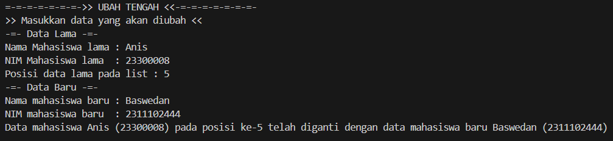

# <h1 align="center">Laporan Praktikum Modul 4 - LINKED LIST CIRCULAR DAN NON CIRCULAR </h1>
<p align="center">Nandana Tsany Farrel Arkananta - 2311102143</p>

# Tujuan Pratikum
a. Praktikan dapat mengetahui dan memahami linked list circular dan non circular.
b. Praktikan dapat membuat linked list circular dan non circular.
c. Praktikan dapat mengaplikasikan atau menerapkan linked list circular dan non 
circular pada program yang dibuat

# Dasar Teori 
<h2>1. Linked List Non Circular</h2>
<p style="text-indent: 45px;">Linked list non circular merupakan linked list dengan node pertama (head) dan node terakhir (tail) yang tidak saling terhubung. Pointer terakhir (tail) pada Linked List ini selalu bernilai ‘NULL’ sebagai pertanda data terakhir dalam list-nya. Linked list non circular dapat digambarkan sebagai berikut.</p></br>
    
<div style="display: block; margin-left: auto; margin-right: auto;"></div></br>

# OPERASI PADA LINKED LIST NON CIRCULAR
1) Deklarasi Simpul (Node)

```C++
struct node
{
int data;
node *next;
};
```

2) Membuat dan Menginisialisasi Pointer Head dan Tail
```C++
node *head, *tail;
void init()
{
head = NULL;
tail = NULL;
};
```

3) Pengecekan Kondisi Linked List
```C++
bool isEmpty()
{
if (head == NULL && tail == NULL)
{
return true;
}
else
{
return false;
}
}
```

4) Penambahan Simpul (Node)
```C++
void insertBelakang(string dataUser)
{
if (isEmpty() == true)
{
node *baru = new node;
baru->data = dataUser;
head = baru;
tail = baru;
baru->next = NULL;
}
else
{
node *baru = new node;
baru->data = dataUser;
baru->next = NULL;
tail->next = baru;
tail = baru;
}
};
```

5) Penghapusan Simpul (Node)
```C++
void hapusDepan()
{
if (isEmpty() == true)
{
cout << "List kosong!" << endl;
}
else
{
node *helper;
helper = head;
if (head == tail)
{
head = NULL;
tail = NULL;
delete helper;
}
else
head = head->next;
helper->next = NULL;
delete helper;
}
}
```

<h2>2. Linked List Circular</h2>
<p style="text-indent: 45px;">Linked list circular merupakan linked list yang tidak memiliki akhir karena node terakhir (tail) tidak bernilai ‘NULL’, tetapi terhubung dengan node pertama (head). Saat menggunakan linked list circular kita membutuhkan dummy node atau node pengecoh yang biasanya dinamakan dengan node current supaya program dapat berhenti menghitung data ketika node current mencapai node pertama (head).Linked list circular dapat digunakan untuk menyimpan data yang perlu diakses secara berulang, seperti daftar putar lagu, daftar pesan dalam antrian, atau penggunaan memori berulang dalam suatu aplikasi. Linked list circular dapat digambarkan sebagai berikut.</p></br>

</br>

1. Deklarasi Simpul (Node)
```c++
struct Node
{
string data;
Node *next;
};

```

2. Membuat dan Menginisialisasi Pointer Head dan Tail
```C++
Node *head, *tail, *baru, *bantu, *hapus;
void init()
{
head = NULL;
tail = head;
}
```

3. Pengecekan Kondisi Linked List
```c++
int isEmpty()
{
if (head == NULL)
return 1; // true
else
return 0; // false
}
```

4. Pembuatan Simpul (Node) 
```c++
void buatNode(string data)
{
baru = new Node;
baru->data = data;
baru->next = NULL;
}
```

5. Penambahan Simpul (Node)
```c++
// Tambah Depan
void insertDepan(string data)
{
// Buat Node baru
buatNode(data);
if (isEmpty() == 1)
{
head = baru;
tail = head;
baru->next = head;
}
else
{
while (tail->next != head)
{
tail = tail->next;
}
baru->next = head;
head = baru;
tail->next = head;
}
}
```

6. Penghapusan Simpul (Node)
```c++
void hapusBelakang()
{
if (isEmpty() == 0)
{
hapus = head;
tail = head;
if (hapus->next == head)
{
head = NULL;
tail = NULL;
delete hapus;
}
else
{
while (hapus->next != head)
{
hapus = hapus->next;
}
while (tail->next != hapus)
{
tail = tail->next;
}
tail->next = head;
hapus->next = NULL;
delete hapus;
}
}
}
```

7. Menampilkan Data Linked List
```C++
void tampil()
{
if (isEmpty() == 0)
{
tail = head;
do
{
cout << tail->data << ends;
tail = tail->next;
} while (tail != head);
cout << endl;
}
}
```

# Guided

1) Linked List Non Circular
```c++
#include <iostream>
using namespace std;
// PROGRAM SINGLE LINK LIST NON CIRCULAR
// DEKLARASI STRUCT NODE

struct node
{
    int data;
    node *next;
};
node *head;
node *tail;

// INSTALASI NODE
void init()
{
    head = NULL;
    tail = NULL;
}

//PENGECEKAN
bool isEmpty()
{
    if(head == NULL)
        return true;

    else
        return false;
}

// TAMBAH DEPAN
void insertDepan(int nilai)
{
    //BUAT NODE BARU
    node *baru = new node;
    baru -> data = nilai;
    baru -> next = NULL;
    if(isEmpty() == true)
    {
        head = tail = baru;
        tail -> next = NULL;
    }
    else
    {
        baru -> next = head;
        head = baru;
    }
}

// TAMBAH BELAKANG
void insertBelakang(int nilai)
{
    // BUAT NODE BARU
    node *baru = new node;
    baru -> data = nilai;
    baru -> next = NULL;
    if(isEmpty() == true)
    {
        head = tail = baru;
        tail -> next = NULL;
    }
    else
    {
        tail -> next = baru;
        tail = baru;
    }
}

// HITUNG JUMLAH LIST
int hitungList()
{
    node *hitung;
    hitung = head;
    int jumlah = 0;
    while(hitung != NULL)
    {
        jumlah++;
        hitung = hitung -> next;
    }
    return jumlah;
}

// TAMBAH TENGAH
void insertTengah(int data, int posisi)
{
    if(posisi < 1 || posisi > hitungList())
    {
        cout << "posisi di liar jangkauan" << endl;
    }
    else if(posisi == 1)
    {
        cout << "posisi buan posisi tengah" << endl;
    }
    else
    {
        node *baru, *bantu;
        baru = new node();
        baru -> data = data;

        // TRANSVERSING
        bantu = head;
        int nomor = 1;
        while(nomor < posisi -1)
        {
            bantu =bantu -> next;
            nomor++;
        }
    
    baru -> next = bantu -> next;
    bantu -> next = baru;
    }
}

//HAPUS DEPAN
void hapusDepan()
{
    node *hapus;
    if(isEmpty() == false)
    {
        if(head -> next != NULL)
        {
            hapus = head;
            head = head -> next;
            delete hapus;
        }
    
    else
    {
        head = tail = NULL;
    }
    }
    else
    {
        cout <<"list kosong" << endl;
    }
}

// HAPUS BELAKNG
void hapusBelakng()
{
    node *hapus;
    node *bantu;
    if(isEmpty() == false)
    {
        if(head != tail)
        {
            hapus = tail;
            bantu = head;
            while(bantu -> next != tail)
            {
                bantu = bantu -> next;
            }
            tail = bantu;
            tail -> next = NULL;
            delete hapus;
        }
        else
        {
            head = tail = NULL;
        }
    }
    else
    {
        cout <<"list kosiing"<< endl;
    }
}

// HAPUS TENGAH
void hapusTengah(int posisi)
{
    node *bantu, *hapus, *sebelum;
    if( posisi < 1 || posisi > hitungList())
    {
        cout <<"posisi di liar jangkauan"<< endl;
    }
    else if(posisi == 1)
    {
        cout <<"posisi bukan posisi tengah"<< endl;
    }
    else 
    {
        int nomor = 1;
        bantu = head;
        while(nomor <= posisi)
        {
            if(nomor == posisi - 1)
            {
                sebelum = bantu;
            }
            if(nomor == posisi)
            {
                hapus = bantu;
            }
            bantu = bantu -> next;
            nomor++;
        }
        sebelum  -> next = bantu;
        delete hapus;
    }

}

// Ubah Depan
void ubahDepan(int data)
{
if (isEmpty() == 0)
{
head->data = data;
}
else
{
cout << "List masih kosong!" << endl;
}
}

// Ubah Tengah
void ubahTengah(int data, int posisi)
{
node *bantu;
if (isEmpty() == 0)
{
    if (posisi < 1 || posisi > hitungList())
{
cout << "Posisi di luar jangkauan" << endl;
}
else if (posisi == 1)
{

}
else
{
cout << "Posisi bukan posisi tengah" << endl;

bantu = head;
int nomor = 1;
while (nomor < posisi)
{
bantu = bantu->next;
nomor++;
}
bantu->data = data;
}
}
else
{
cout << "List masih kosong!" << endl;
}
}

// Ubah Belakang
void ubahBelakang(int data)
{
if (isEmpty() == 0)
{
tail->data = data;
}
else
{
cout << "List masih kosong!" << endl;
}
}

// Hapus List
void clearList()
{
node *bantu, *hapus;
bantu = head;
while (bantu != NULL)
{
hapus = bantu;
bantu = bantu->next;
delete hapus;
}
head = tail = NULL;
cout << "List berhasil terhapus!" << endl;
}

// Tampilkan List
void tampil()
{
node *bantu;
bantu = head;
if (isEmpty() == false)
{
while (bantu != NULL)
{
cout << bantu->data << ends;
bantu = bantu->next;
}
cout << endl;
}
else
{
cout << "List masih kosong!" << endl;
}
}

int main()
{
init();
insertDepan(3);
tampil();
insertBelakang(5);
tampil();
insertDepan(2);
tampil();
insertDepan(1);
tampil();
hapusDepan();
tampil();
hapusBelakng();
tampil();
insertTengah(7, 2);
tampil();
hapusTengah(2);
tampil();
ubahDepan(1);
tampil();
ubahBelakang(8);
tampil();
ubahTengah(11, 2);
tampil();

return 0;
}

```
# Output
</br>
Single linked list adalah struktur data linear yang terdiri dari sejumlah simpul atau node yang saling terhubung melalui pointer, dimana setiap node memiliki data dan pointer yang menunjuk ke node berikutnya. Program ini digunakan untuk membuat, mengelola, dan memanipulasi daftar data secara dinamis, dimana setiap elemen data dihubungkan oleh satu arah, yaitu dari depan ke belakang. Program ini memberikan kemampuan untuk menambah, menghapus, dan mengubah data pada posisi tertentu dalam daftar tersebut.

2) Linked List Circular 
```C++
#include <iostream>

using namespace std;

// Program SINGLE LINGKED LIST SIRCULAR

// Deklarasi Struct Node
struct  Node
{
    string data;
    Node*next;
};

Node *head, *tail, *baru, *bantu, *hapus;

void init()
{
    head = NULL;
    tail = head;
}

// Pengecekan
int isEmpty()
{
    if (head == NULL)
    return 1; // true
    else
    return 0; // false
}

// Buat Node baru
void buatNode(string data)
{
    baru = new Node;
    baru->data = data;
    baru->next = NULL;
}

//hitung list
int hitunglist()
{
    bantu = head;
    int jumlah = 0;

    while (bantu != NULL)
    {
        jumlah++;
        bantu = bantu->next;
    }
    return jumlah;
}

// Tambah Depan

void insertDepan(string data)
{
    // buat Node Baru
    buatNode(data);

    if (isEmpty() == 1)
    {
        head = baru;
        tail = head;
        baru->next = head;
    }
    else 
    {
        while (tail->next != head)
        {
            tail = tail->next;
        }
        baru->next = head;
        head = baru;
        tail->next = head;
    }
}

// Tambah Belakang
void insertBelakang(string data)
{
    // Buat Node baru
    buatNode(data);

    if(isEmpty() == 1)
    {
        head = baru;
        tail = head;
        baru->next = head;
    }
    else
    {
        while (tail->next != head)
        {
            tail = tail->next;
        }

        tail->next = baru; 
        baru->next = head;
        tail = baru;
    }
}
// Tambah Tengah
void insertTengah(string data, int posisi)
{
    if(isEmpty() == 1)
    {
        head = baru;
        tail = head;
        baru->next = head;
    }
    else
    {
        baru->data = data;
        //Transvering
        int nomor = 1;
        bantu = head;
        while(nomor < posisi - 1)
        {
            bantu = bantu->next;
            nomor++;
        }
        baru->next = bantu->next;
        bantu->next = baru;
    }
}
// Hapus Depan
void hapusDepan()
{
    if (isEmpty() == 0)
    {
        hapus = head;
        tail = NULL;

        delete hapus;
    }
    else 
    {
        while(tail->next != hapus)
        {
            tail = tail->next;
        }
        head = head->next;
        tail->next = head;
        hapus->next = NULL;

        delete hapus;
    }
}
// hapus belakang
void hapusBelakang()
{
    if(isEmpty() == 0)
    {
        hapus = head;
        tail = head;
        if(hapus->next == head)
        {
            head = NULL;
            tail = NULL;

            delete hapus;
        }
        else
        {
            while (hapus->next != head)
            {
                hapus = hapus->next;
            }
            while (tail->next != hapus)
            {
                tail = tail->next;
            }
            tail->next = head;
            hapus->next = NULL;

            delete hapus;
        }
    }
    else
    {
        cout << "List masih kosong!" << endl;
    }
}
// Hapus tengah
void hapusTengah(int posisi)
{
    if (isEmpty() == 0)
    {
        //Transvering
        int nomor = 1;
        bantu = head;

        while (nomor < posisi -1)
        {
            bantu = bantu->next;
            nomor++;
        }
        hapus = bantu->next;
        bantu->next = hapus->next;

        delete hapus;
    }
    else
    {
        cout << "List masih kosong!" << endl;
    }
}

// Hapus list
void clearlist()
{
    if (head != NULL)
    {
        hapus = head->next;

        while (hapus != head)
        {
            bantu = hapus->next;
            delete hapus;
            hapus = bantu;
        }
        delete head;
        head = NULL;
    }
    cout << "List berhasil terhapus!" << endl;
}

// Tampilkan list
void tampil()
{
    if(isEmpty() == 0)
    {
        tail = head;
        do
        {
            cout << tail->data << ends;
            tail = tail->next;
        } 
        while (tail != head);
        cout << endl;
    }
    else
    {
        cout << "List masih kosong!" << endl;
    }
}

int main()
{
init();
insertDepan("Ayam");
tampil();
insertDepan("Bebek");
tampil();
insertBelakang("Cicak");
tampil();
insertBelakang("Domba");
tampil();
hapusBelakang();
tampil();
hapusDepan();
tampil();
insertTengah("keboo", 3);
tampil();
hapusTengah(2);
tampil();

return 0;
}
```
# Output 
</br>
Single linked list circular adalah struktur data linear yang terdiri dari sejumlah simpul atau node yang saling terhubung melalui pointer, dimana node terakhir terhubung kembali ke node pertama, membentuk Circular. Secara singkat, program ini digunakan untuk membuat, mengelola, dan memanipulasi daftar data secara dinamis dalam bentuk Circular, dimana setiap elemen data dihubungkan dari awal ke akhir dan kembali ke awal, membentuk suatu Circular.

# Unguided

1) Buatlah menu untuk menambahkan, mengubah, menghapus, dan melihat Nama dan NIM mahasiswa

```C++
#include<iostream>
#include<iomanip>

using namespace std;

// Deklarasi struct node
struct node{
    string Nama_143;
    string NIM_143;
    node *next;
};
node *head;
node *tail;

// Inisialisasi node head & tail
void Inisialisasi_143(){
    head = NULL;
    tail = NULL;
}

// Fungsi pengecekan
bool isEmpty_143(){
    return head == NULL;
}

// Prosedur hitung node
int HitungNode_143(){
    node *hitung = head;
    int jumlah_143 = 0;
    while (hitung != NULL){
        hitung = hitung->next;
        jumlah_143++;
    }
    return jumlah_143;
}

// Prosedur tambah depan
void TambahDepan_143(string Name_143, string NIM_143){
    node *baru = new node;
    baru->Nama_143 = Name_143;
    baru->NIM_143 = NIM_143;
    baru->next = NULL;
    if(isEmpty_143()){
        head = tail = baru;
    } else {
        baru->next = head;
        head = baru;
    }
}

// Prosedur tambah belakang
void TambahBelakang_143(string Name_143, string NIM_143){
    node *baru = new node;
    baru->Nama_143 = Name_143;
    baru->NIM_143 = NIM_143;
    baru->next = NULL;
    if(isEmpty_143()){
        head = tail = baru;
    } else {
        tail->next = baru;
        tail = baru;
    }
}

// Prosedur tambah tengah
void TambahTengah_143(string Name_143, string NIM_143, int Position_143){
    if(Position_143 < 1 || Position_143 > HitungNode_143()){
        cout << "Node yang ingin ditambah diluar jangkauan !!" << endl;
    } else if(Position_143 == 1){
        cout << "Node yang ingin ditambah bukan ditengah !!"<< endl;
    } else {
        node *bantu = head;
        node *baru = new node;
        baru->Nama_143 = Name_143;
        baru->NIM_143 = NIM_143;
        int hitung_143 = 1;
        while(hitung_143 < Position_143 - 1){
            bantu = bantu->next;
            hitung_143++;
        }
        baru->next = bantu->next;
        bantu->next = baru;
    }
}

// Prosedur hapus depan
void HapusDepan_143(){
    if(isEmpty_143()){
        cout << "List masih kosong !!" << endl;
    } else {
        node *hapus = head;
        head = head->next;
        delete hapus;
    }
}

// Fungsi tampil data depan
void TampilDepan_143(){
    if(isEmpty_143()){
        cout << "List masih kosong !!" << endl;
    } else {
        cout << "Data terdepan: " << head->Nama_143 << " - " << head->NIM_143 << endl;
    }
}

// Prosedur hapus belakang
void HapusBelakang_143(){
    if(isEmpty_143()){
        cout << "List masih kosong !!" << endl;
    } else {
        if(head == tail) {
            delete head;
            head = tail = NULL;
        } else {
            node *hapus = head;
            while(hapus->next != tail){
                hapus = hapus->next;
            }
            delete tail;
            tail = hapus;
            tail->next = NULL;
        }
    }
}

// Fungsi tampil data belakang
void TampilBelakang_143(){
    if(isEmpty_143()){
        cout << "List masih kosong !!" << endl;
    } else {
        cout << "Data terbelakang: " << tail->Nama_143 << " - " << tail->NIM_143 << endl;
    }
}

// Prosedur hapus tengah
void HapusTengah_143(int posisi_143){
    if(posisi_143 < 1 || posisi_143 > HitungNode_143()){ 
        cout << "Posisi node yang akan dihapus offside !!" << endl;
    } else if(posisi_143 == 1){
        cout << "Node yang ingin dihapus bukan node tengah" << endl;
    } else {
        node *hapus = head;
        node *bantu = NULL;
        for(int i = 1; i < posisi_143; i++) {
            bantu = hapus;
            hapus = hapus->next;
        }
        bantu->next = hapus->next;
        delete hapus;
    }
}

// Fungsi tampil data tengah
void TampilTengah_143(int Position_143){
    node *tampil = head;
    if(isEmpty_143()){
        cout << "List masih kosong !!" << endl;
    } else {
        for(int i = 1; i < Position_143; i++){
            tampil = tampil->next;
        }
        cout << "Data pada posisi " << Position_143 << ": " << tampil->Nama_143 << " - " << tampil->NIM_143 << endl;       
    }
}

// Prosedur ubah depan
void UbahDepan_143(string NewName_143, string NewNIM_143){
    if(isEmpty_143()){
        cout << "List masih kosong !!" << endl;
    } else {
        head->Nama_143 = NewName_143;
        head->NIM_143 = NewNIM_143;
    }
}

// Prosedur ubah belakang
void UbahBelakang_143(string NewName_143, string NewNIM_143){
    if(isEmpty_143()){
        cout << "List masih kosong !!" << endl;
    } else {
        tail->Nama_143 = NewName_143;
        tail->NIM_143 = NewNIM_143;
    }
}

// Prosedur ubah tengah
void UbahTengah_143(string NewName_143, string NewNIM_143, int Position_143){
    if(isEmpty_143()){
        cout << "List masih kosong!" << endl;
    } else {
        if(Position_143 < 1 || Position_143 > HitungNode_143()){
            cout << "Node yang ingin diubah diluar jangkauan !!" << endl;
        } else if(Position_143 == 1){
            cout << "Node yang ingin diubah bukan ditengah !!" << endl;
        } else {
            node *bantu = head;
            for(int i = 1; i < Position_143; i++){
                bantu = bantu->next;
            }
            bantu->Nama_143 = NewName_143;
            bantu->NIM_143 = NewNIM_143;
        }
    }
}

// Prosedur hapus list
void HapusList_143(){
    node *hapus;
    while(head != NULL){
        hapus = head;
        head = head->next;
        delete hapus;   
    }
    tail = NULL;
}

// Prosedur tampil list
void TampilList_143(){
    if(isEmpty_143()){
        cout << "List masih kosong !!" << endl;
    } else {
        cout << "------------------------------------------" << endl;
        cout << "|         NAMA         |       NIM       |" << endl;
        cout << "------------------------------------------" << endl;
        node *bantu = head;
        while(bantu != NULL){
            cout << "|" << setw(22) << left << bantu->Nama_143 << "|" << setw(17) << left << bantu->NIM_143 << "|" << endl;
            bantu = bantu->next;
        }
        cout << "------------------------------------------" << endl;
    }
}

int main(){
    int Position_143, Choose_143;
    string Name_143, OldName_143, NIM_143, OldNIM_143;
    char Yakin_143;
    Inisialisasi_143();
    MenuUtama:
    cout << "-=-=-=->> PROGRAM SINGLE LINKED LIST <<-=-=-=-=" << endl;
    cout << "-=-=-=-=-=-=->> NON-CIRCULAR <<-=-=-=-=-=-=-=-=" << endl; 
    cout << "1. TAMBAH DEPAN" << endl;
    cout << "2. TAMBAH BELAKANG" << endl;
    cout << "3. TAMBAH TENGAH" << endl;
    cout << "4. UBAH DEPAN" << endl;
    cout << "5. UBAH BELAKANG" << endl;
    cout << "6. UBAH TENGAH" << endl;
    cout << "7. HAPUS DEPAN" << endl;
    cout << "8. HAPUS BELAKANG" << endl;
    cout << "9. HAPUS TENGAH" << endl;
    cout << "10. HAPUS LIST" << endl;
    cout << "11. TAMPILKAN" << endl;
    cout << "0. KELUAR" << endl;
    cout << "Masukkan pilihan anda : ";
    cin >> Choose_143;
    cout << endl;
    switch(Choose_143){

        case 1:
            cout << "=-=-=-=-=-=->> TAMBAH DEPAN <<-=-=-=-=-=-=" << endl;
            cout << ">> Masukkan data yang ingin ditambahkan <<" << endl;
            cout << "Nama Mahasiswa : ";
            cin >> Name_143;
            cout << "NIM Mahasiswa  : ";
            cin >> NIM_143;
            TambahDepan_143(Name_143, NIM_143);
            cout << "Data berhasil ditambahkan!!" << endl;
            cout << endl;
            goto MenuUtama;
            break;

        case 2:
            cout << "=-=-=-=-=->> TAMBAH BELAKANG <<=-=-=-=-=-=" << endl;
            cout << ">> Masukkan data yang ingin ditambahkan <<" << endl;
            cout << "Nama Mahasiswa : ";
            cin >> Name_143;
            cout << "NIM Mahasiswa  : ";
            cin >> NIM_143;
            TambahBelakang_143(Name_143, NIM_143);
            cout << "Data berhasil ditambahkan!!" << endl;
            cout << endl;
            goto MenuUtama;
            break;

        case 3:
            cout << "=-=-=-=-=-=->> TAMBAH TENGAH <<-=-=-=-=-=-" << endl;
            cout << ">> Masukkan data yang ingin ditambahkan <<" << endl;
            cout << "Nama Mahasiswa : ";
            cin >> Name_143;
            cout << "NIM Mahasiswa  : ";
            cin >> NIM_143;
            cout << "Posisi data    : ";
            cin >> Position_143;
            TambahTengah_143(Name_143, NIM_143, Position_143);
            cout << "Data berhasil ditambahkan!!" << endl;
            cout << endl;
            goto MenuUtama;
            break;

        case 4:
            cout << "=-=-=-=-=-=-=->> UBAH DEPAN <<-=-=-=-=-=-=-=" << endl;
            cout << ">> Masukkan data yang akan diubah <<" << endl;
            cout << "--- Data Lama ---" << endl;
            cout << "Nama Mahasiswa lama : ";
            cin >> OldName_143;
            cout << "NIM Mahasiswa lama  : ";
            cin >> OldNIM_143;
            cout << "-=- Data Baru -=-" << endl;
            cout << "Nama mahasiswa baru : "; 
            cin >> Name_143;
            cout << "NIM mahasiswa baru  : ";
            cin >> NIM_143;
            UbahDepan_143(Name_143, NIM_143);
            cout << "Data mahasiswa " << OldName_143 << " (" << OldNIM_143 << ") telah diganti dengan data mahasiswa baru " << Name_143 << " (" << NIM_143 << ")" << endl;
            cout << endl;
            goto MenuUtama;
            break;

        case 5:
            cout << "=-=-=-=-=-=-=->> UBAH BELAKANG <<-=-=-=-=-=-=-=" << endl;
            cout << ">> Masukkan data yang akan diubah <<" << endl;
            cout << "-=- Data Lama -=-" << endl;
            cout << "Nama Mahasiswa lama : ";
            cin >> OldName_143;
            cout << "NIM Mahasiswa lama  : ";
            cin >> OldNIM_143;
            cout << "-=- Data Baru -=-" << endl;
            cout << "Nama mahasiswa baru : "; 
            cin >> Name_143;
            cout << "NIM mahasiswa baru  : ";
            cin >> NIM_143;
            UbahBelakang_143(Name_143, NIM_143);
            cout << "Data mahasiswa " << OldName_143 << " (" << OldNIM_143 << ") telah diganti dengan data mahasiswa baru " << Name_143 << " (" << NIM_143 << ")" << endl;
            cout << endl;
            goto MenuUtama;
            break;

        case 6:
            cout << "=-=-=-=-=-=-=->> UBAH TENGAH <<-=-=-=-=-=-=-=-" << endl;
            cout << ">> Masukkan data yang akan diubah <<" << endl;
            cout << "-=- Data Lama -=-" << endl;
            cout << "Nama Mahasiswa lama : ";
            cin >> OldName_143;
            cout << "NIM Mahasiswa lama  : ";
            cin >> OldNIM_143;
            cout << "Posisi data lama pada list : ";
            cin >> Position_143;
            cout << "-=- Data Baru -=-" << endl;
            cout << "Nama mahasiswa baru : "; 
            cin >> Name_143;
            cout << "NIM mahasiswa baru  : ";
            cin >> NIM_143;
            UbahTengah_143(Name_143, NIM_143, Position_143);
            cout << "Data mahasiswa " << OldName_143 << " (" << OldNIM_143 << ") pada posisi ke-" << Position_143 << " telah diganti dengan data mahasiswa baru " << Name_143 << " (" << NIM_143 << ")" << endl;
            cout << endl;
            goto MenuUtama;
            break;

        case 7:
            cout << "=-=-=-=-=-=-=->> HAPUS DEPAN <<-=-=-=-=-=-=-=-=" << endl;
            cout << "Apakah anda yakin untuk menghapus data mahasiswa " << TampilDepan_143() << "?? [y/n] : ";
            cin >> Yakin_143;
            if(Yakin_143 == 'y' || Yakin_143 == 'Y'){
                HapusDepan_143();
                cout << "Data telah dihapus !!" << endl;
            } else if(Yakin_143 == 'n' || Yakin_143 == 'N'){
                cout << "Aksi dibatalkan" << endl;
            }
            cout << endl;
            goto MenuUtama;
            break;

        case 8:
            cout << "=-=-=-=-=-=-=->> HAPUS BELAKANG <<-=-=-=-=-=-=-=" << endl;
            cout << "Apakah anda yakin untuk menghapus data mahasiswa " << TampilBelakang_143() << "? [y/n] : ";
            cin >> Yakin_143;
            if(Yakin_143 == 'y' || Yakin_143 == 'Y'){
                HapusBelakang_143();
                cout << "Data telah dihapus !!" << endl;
            } else if(Yakin_143 == 'n' || Yakin_143 == 'N'){
                cout << "Aksi dibatalkan" << endl;
            }
            cout << endl;
            goto MenuUtama;
            break;

        case 9:
            cout << "=-=-=-=-=-=-=->> HAPUS TENGAH <<-=-=-=-=-=-=-=" << endl;
            cout << "Masukkan posisi data yang ingin dihapus : ";
            cin >> Position_143;
            cout << "Apakah anda yakin untuk menghapus data mahasiswa " << TampilTengah_143(Position_143) << "? [y/n] : ";
            cin >> Yakin_143;
            if(Yakin_143 == 'y' || Yakin_143 == 'Y'){
                HapusTengah_143(Position_143);
                cout << "Data telah dihapus !!" << endl;
            } else if(Yakin_143 == 'n' || Yakin_143 == 'N'){
                cout << "Aksi dibatalkan" << endl;
            }
            cout << endl;
            goto MenuUtama;
            break;

        case 10:
            cout << "-=-=-=-=-=-=-=->> HAPUS LIST <<=--=-=-=-=-=-=-=" << endl;
            cout << "Apakah anda yakin untuk menghapus semua data? [y/n] : ";
            cin >> Yakin_143;
            if(Yakin_143 == 'y' || Yakin_143 == 'Y'){
                HapusList_143();
                cout << "List telah terhapus !!" << endl; 
            } else if(Yakin_143 == 'n' || Yakin_143 == 'N'){
                cout << "Aksi dibatalkan" << endl;
            }
            cout << endl;
            goto MenuUtama;
            break;

        case 11:
            cout << "=-=-=-=-=-=->> TAMPIL LIST <<-=-=-=-=-=-=-=" << endl;
            TampilList_143();
            cout << endl;
            goto MenuUtama;
            break;

        case 0:
            cout << "Anda telah keluar dari program !!" << endl;
            return 0;
            break;
        default:
            cout << "Pilihan anda tidak tersedia !!" << endl;
            cout << endl;
            goto MenuUtama;
            break;
    }
}

```
## Output Unguided 1
#### Tampilan Menu:

#### Tampilan Operasi Tambah:


#### Tampilan Operasi Hapus:


#### Tampilan Operasi Ubah:



#### Tampilan Hapus List

#### Tampilan


2) Setelah membuat menu tersebut, masukkan data sesuai urutan berikut, lalu tampilkan data yang telah dimasukkan. (Gunakan insert depan, belakang atau tengah)


## Output Unguided 2


3) Lakukan perintah berikut:
    a) Tambahkan data berikut diantara Farrel dan Denis:
    Wati 2330004
    b) Hapus data Denis
    c) Tambahkan data berikut di awal:
    Owi 2330000
    d) Tambahkan data berikut di akhir:
    David 23300100
    e) Ubah data Udin menjadi data berikut:
    Idin 23300045
    f) Ubah data terkahir menjadi berikut:
    Lucy 23300101
    g) Hapus data awal
    h) Ubah data awal menjadi berikut:
    Bagas 2330002
    i) Hapus data akhir
    j) Tampilkan seluruh data

## Output Unguided 3
#### Menambahkan-Wati-Diantara-Farrel-Dan-Denis

#### Menghapus-Data-Denis

#### Menambahkan-Owi-Diawal

#### Menambahkan-David-Diakhir

#### Mengubah-Data-Udin-Menjadi-Idin

#### Mengubah-Data-Terakhir-Menjadi-Lucy

#### Menghapus-Data-Awal

#### Mengubah-Data-Awal-Menjadi-Bagas

#### Hapus-Data-Akhir

#### Menampilkan-Seluruh-Data


# Kesimpulan 

Pada praktikum ini, tujuannya adalah agar kita bisa memahami dan dapat menciptakan linked list yang berbentuk Circular dan yang Non-Circular. 

Kita berhasil dengan mengikuti langkah-langkah sebagai berikut:

a. Paham tentang Linked List Circular dan Non-Circular:
   Kita belajar bahwa linked list adalah cara menyimpan data secara terhubung satu sama lain. Kita juga paham bahwa ada bedanya antara linked list yang bisa membentuk Circular dan yang Non-Circular. Yang membentuk Circular, elemen terakhirnya terhubung kembali ke elemen pertama.

b. Membuat Linked List Circular dan Non-Circular:
   Kita membuat bikin linked list yang dapat membentuk Circular dan yang Non-Circular menggunakan bahasa pemrograman yang kita pilih. Kita dapat menciptakan struktur data yang benar dan menghubungkan elemen-elemennya.

c. Pakai Linked List Circular dan Non-Circular di Program:
   Kita berhasil menggunakan linked list Circular dan Non-Circular di dalam program-program sederhana yang kita buat. Kita memakai linked list sebagai cara simpan dan kelola data dengan efisien di dalam program.

Dengan begitu, kita sudah berhasil mencapai tujuan praktikum. Kita tidak hanya paham konsep linked list Circular dan Non-Circular, tapi juga bisa buat dan gunakan dalam program. Ini menunjukkan bahwa kita sudah menguasai materi praktikum dengan baik.

# Referensi
[1] Muhammad Nugraha, Dasar Pemrograman Dengan C++, Materi Paling Dasar untuk Menjadi Programmer Berbagai Platform Yogyakarta: Deepublish, 2021.
[2] Triase, 2020. "Diktat Edisi Revisi : STRUKTUR DATA". Medan: UNIVERSTAS ISLAM NEGERI SUMATERA UTARA MEDAN.
[3] A VijayaPandian,2018. "Enhanced Linked List Visualizer Tutor for C++". California State University, San Marcos


