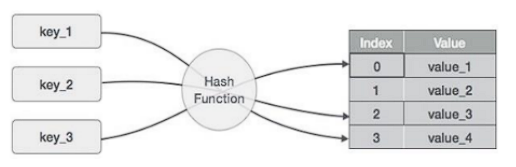

# <h1 align="center">Laporan Praktikum Modul Hash Table</h1>

<p align="center">Nandana Tsany Farrel Arkananta - 2311102143</p>

## Dasar Teori

#### Pengertian Hash Table

Hash Table adalah struktur data yang menggunakan teknik hashing untuk mengatur data ke dalam pasangan kunci-nilai. Terdiri dari array dan fungsi hash, hash table menyimpan data dalam bucket yang diindeks oleh fungsi hash. Ini memungkinkan pencarian data dalam waktu konstan (O(1)) dalam kasus terbaik. Saat mencari data, kunci digunakan untuk menghasilkan indeks array melalui fungsi hash. Dalam kasus collision, di mana dua data memiliki nilai hash yang sama, hash table menggunakan teknik chaining untuk menyimpan data dalam slot yang sama.



#### Fungsi Hash Table

Fungsi hash membuat pemetaan antara kunci dan nilai, hal ini dilakukan
melalui penggunaan rumus matematika yang dikenal sebagai fungsi hash. Hasil
dari fungsi hash disebut sebagai nilai hash atau hash. Nilai hash adalah
representasi dari string karakter asli tetapi biasanya lebih kecil dari aslinya.

#### Operasi Hash Table

1. Insertion:
   Memasukkan data baru ke dalam hash table dengan memanggil fungsi hash
   untuk menentukan posisi bucket yang tepat, dan kemudian menambahkan
   data ke bucket tersebut.
2. Deletion:
   Menghapus data dari hash table dengan mencari data menggunakan fungsi
   hash, dan kemudian menghapusnya dari bucket yang sesuai.
3. Searching:
   Mencari data dalam hash table dengan memasukkan input kunci ke fungsi
   hash untuk menentukan posisi bucket, dan kemudian mencari data di dalam
   bucket yang sesuai.
4. Update:
   Memperbarui data dalam hash table dengan mencari data menggunakan
   fungsi hash, dan kemudian memperbarui data yang ditemukan.
5. Traversal:
   Melalui seluruh hash table untuk memproses semua data yang ada dalam
   tabel.

#### Collision Resolution

Keterbatasan tabel hash adalah jika dua angka dimasukkan ke dalam fungsi
hash menghasilkan nilai yang sama. Hal ini disebut dengan collision. Ada dua
teknik untuk menyelesaikan masalah ini diantaranya :


1. Metode chaining mengatasi collision dengan cara menyimpan semua
   item data dengan nilai indeks yang sama ke dalam sebuah linked list. Setiap
   node pada linked list merepresentasikan satu item data. Ketika ada pencarian
   atau penambahan item data, pencarian atau penambahan dilakukan pada
   linked list yang sesuai dengan indeks yang telah dihitung dari kunci yang di
   hash. Ketika linked list memiliki banyak node, pencarian atau penambahan
   item data menjadi lambat, karena harus mencari di seluruh linked list.
   Namun, chaining dapat mengatasi jumlah item data yang besar dengan
   efektif, karena keterbatasan array dihindari.

2. Closed Hashing

##### Linear Probing

Pada saat terjadi collision, maka akan mencari posisi yang kosong di
bawah tempat terjadinya collision, jika masih penuh terus ke bawah,
hingga ketemu tempat yang kosong. Jika tidak ada tempat yang kosong
berarti HashTable sudah penuh

##### Quadratic Probing

Penanganannya hampir sama dengan metode linear, hanya
lompatannya tidak satu-satu, tetapi quadratic ( 12, 22, 32, 42, ... )

##### Double Hashing

Pada saat terjadi collision, terdapat fungsi hash yang kedua untuk
menentukan posisinya kembali.

## Guided

### 1. Array Dinamis Table

```C++
#include <iostream>
using namespace std;
const int MAX_SIZE = 10;
// Fungsi hash sederhana
int hash_func(int key)
{
    return key % MAX_SIZE;
}
// Struktur data untuk setiap node
struct Node
{
    int key;
    int value;
    Node *next;
    Node(int key, int value) : key(key), value(value),
                               next(nullptr) {}
};
// Class hash table
class HashTable
{
private:
    Node **table;

public:
    HashTable()
    {
        table = new Node *[MAX_SIZE]();
    }
    ~HashTable()
    {
        for (int i = 0; i < MAX_SIZE; i++)
        {
            Node *current = table[i];
            while (current != nullptr)
            {
                Node *temp = current;
                current = current->next;
                delete temp;
            }
        }
        delete[] table;
    }
    // Insertion
    void insert(int key, int value)
    {
        int index = hash_func(key);
        Node *current = table[index];
        while (current != nullptr)
        {
            if (current->key == key)
            {
                current->value = value;
                return;
            }
            current = current->next;
        }
        Node *node = new Node(key, value);
        node->next = table[index];
        table[index] = node;
    }
    // Searching
    int get(int key)
    {
        int index = hash_func(key);
        Node *current = table[index];
        while (current != nullptr)
        {
            if (current->key == key)
            {
                return current->value;
            }
            current = current->next;
        }
        return -1;
    }
    // Deletion
    void remove(int key)
    {
        int index = hash_func(key);
        Node *current = table[index];
        Node *prev = nullptr;
        while (current != nullptr)
        {
            if (current->key == key)
            {
                if (prev == nullptr)
                {
                    table[index] = current->next;
                }
                else
                {
                    prev->next = current->next;
                }
                delete current;
                return;
            }
            prev = current;
            current = current->next;
        }
    }
    // Traversal
    void traverse()
    {
        for (int i = 0; i < MAX_SIZE; i++)
        {
            Node *current = table[i];
            while (current != nullptr)
            {
                cout << current->key << ": " << current->value
                     << endl;
                current = current->next;
            }
        }
    }
};
int main()
{
    HashTable ht;
    // Insertion
    ht.insert(1, 10);
    ht.insert(2, 20);
    ht.insert(3, 30);
    // Searching
    cout << "Get key 1: " << ht.get(1) << endl;
    cout << "Get key 4: " << ht.get(4) << endl;
    // Deletion
    ht.remove(4);
    // Traversal
    ht.traverse();
    return 0;
}

```

Kode di atas menggunakan array dinamis “table” untuk menyimpan bucket dalam
hash table. Setiap bucket diwakili oleh sebuah linked list dengan setiap node
merepresentasikan satu item data. Fungsi hash sederhana hanya menggunakan
modulus untuk memetakan setiap input kunci ke nilai indeks array.


### 2. Class Hash Node

```C++
#include <iostream>
#include <string>
#include <vector>
using namespace std;
const int TABLE_SIZE = 11;
string name;
string phone_number;
class HashNode
{
public:
    string name;
    string phone_number;
    HashNode(string name, string phone_number)
    {
        this->name = name;
        this->phone_number = phone_number;
    }
};
class HashMap
{
private:
    vector<HashNode *> table[TABLE_SIZE];

public:
    int hashFunc(string key)
    {
        int hash_val = 0;
        for (char c : key)
        {
            hash_val += c;
        }
        return hash_val % TABLE_SIZE;
    }
    void insert(string name, string phone_number)
    {
        int hash_val = hashFunc(name);
        for (auto node : table[hash_val])
        {
            if (node->name == name)
            {
                node->phone_number = phone_number;
                return;
            }
        }
        table[hash_val].push_back(new HashNode(name,
                                               phone_number));
    }
    void remove(string name)
    {
        int hash_val = hashFunc(name);
        for (auto it = table[hash_val].begin(); it !=
                                                table[hash_val].end();
             it++)
        {
            if ((*it)->name == name)
            {
                table[hash_val].erase(it);
                return;
            }
        }
    }
    string searchByName(string name)
    {
        int hash_val = hashFunc(name);
        for (auto node : table[hash_val])
        {
            if (node->name == name)
            {
                return node->phone_number;
            }
        }
        return "";
    }
    void print()
    {
        for (int i = 0; i < TABLE_SIZE; i++)
        {
            cout << i << ": ";
            for (auto pair : table[i])
            {
                if (pair != nullptr)
                {
                    cout << "[" << pair->name << ", " << pair->phone_number << "]";
                }
            }
            cout << endl;
        }
    }
};
int main()
{
    HashMap employee_map;
    employee_map.insert("Mistah", "1234");
    employee_map.insert("Pastah", "5678");
    employee_map.insert("Ghana", "91011");
    cout << "Nomer Hp Mistah : "
         << employee_map.searchByName("Mistah") << endl;
    cout << "Phone Hp Pastah : "
         << employee_map.searchByName("Pastah") << endl;
    employee_map.remove("Mistah");
    cout << "Nomer Hp Mistah setelah dihapus : "
         << employee_map.searchByName("Mistah") << endl
         << endl;
    cout << "Hash Table : " << endl;
    employee_map.print();
    return 0;
}


```

Pada program di atas, class HashNode merepresentasikan setiap node dalam hash
table, yang terdiri dari nama dan nomor telepon karyawan. Class HashMap
digunakan untuk mengimplementasikan struktur hash table dengan menggunakan
vector yang menampung pointer ke HashNode. Fungsi hashFunc digunakan
untuk menghitung nilai hash dari nama karyawan yang diberikan, dan fungsi
insert digunakan untuk menambahkan data baru ke dalam hash table. Fungsi
remove digunakan untuk menghapus data dari hash table, dan fungsi
searchByName digunakan untuk mencari nomor telepon dari karyawan dengan
nama yang diberikan.


# Unguided

### 1. Soal mengenai Implementasi Hash Table untuk Menyimpan Data Mahasiswa

Implementasikan hash table untuk menyimpan data mahasiswa. Setiap mahasiswa
memiliki NIM dan nilai. Implementasikan fungsi untuk menambahkan data baru,
menghapus data, mencari data berdasarkan NIM, dan mencari data berdasarkan
nilai. Dengan ketentuan :

1. Setiap mahasiswa memiliki NIM dan nilai.
2. Program memiliki tampilan pilihan menu berisi poin C.
3. Implementasikan fungsi untuk menambahkan data baru, menghapus data,
mencari data berdasarkan NIM, dan mencari data berdasarkan rentang nilai
(80 – 90).


```C++
// Nandana Tsany Farrel Arkananta_2311102143_S1IF11D

#include <iostream>
#include <string>
#include <vector>
#include <cmath> // Untuk penggunaan fungsi pow
#include <limits> // Untuk membersihkan buffer

using namespace std;

// Struktur data mahasiswa
struct Mahasiswa {
    string nama;
    string nim_143;
    int nilai;
};

// Class HashTable
class HashTable {
private:
    static const int TABLE_SIZE = 100; // Ukuran tabel hash
    vector<vector<Mahasiswa>> table;   // Tabel hash sebagai vector of vector

    // Fungsi hash sederhana
    int hashFunc(const string& key) {
        int hash = 0;
        for (char c : key) {
            hash += c;
        }
        return hash % TABLE_SIZE;
    }

public:
    // Konstruktor, menginisialisasi tabel hash
    HashTable() {
        table.resize(TABLE_SIZE);
    }

    // Menambah data
    void insert(const Mahasiswa& mhs) {
        int index = hashFunc(mhs.nama);
        table[index].push_back(mhs);
        cout << "Data Mahasiswa dengan Nama " << mhs.nama << " berhasil ditambahkan." << endl;
    }

    // Menghapus data berdasarkan nama
    void remove(const string& nama) {
        int index = hashFunc(nama);
        bool found = false;
        for (auto it = table[index].begin(); it != table[index].end(); ++it) {
            if (it->nama == nama) {
                table[index].erase(it);
                cout << "Data Mahasiswa dengan nama " << nama << " berhasil dihapus." << endl;
                found = true;
                break;
            }
        }
        if (!found) {
            cout << "Mahasiswa dengan Nama " << nama << " tidak ditemukan." << endl;
        }
    }

    // Cari data berdasarkan NIM
    void searchByNIM(const string& nim_143) {
        bool found = false;
        cout << "\nCARI DATA MAHASISWA (NIM)" << endl;
        for (const auto& bucket : table) {
            for (const auto& mhs : bucket) {
                if (mhs.nim_143 == nim_143) {
                    cout << "Nama: " << mhs.nama << ", NIM: " << mhs.nim_143 << ", Nilai: " << mhs.nilai << endl;
                    found = true;
                    break;
                }
            }
            if (found) break;
        }
        if (!found) {
            cout << "Mahasiswa dengan NIM " << nim_143 << " tidak ditemukan." << endl;
        }
    }

    // Mencari data berdasarkan rentang nilai
    void searchByRange(int minNilai, int maxNilai) {
        cout << "\nCARI DATA MAHASISWA (RENTANG NILAI)" << endl;
        bool found = false;
        for (const auto& bucket : table) {
            for (const auto& mhs : bucket) {
                if (mhs.nilai >= minNilai && mhs.nilai <= maxNilai) {
                    cout << "Nama: " << mhs.nama << ", NIM: " << mhs.nim_143 << ", Nilai: " << mhs.nilai << endl;
                    found = true;
                }
            }
        }
        if (!found) {
            cout << "Tidak ada data Mahasiswa dengan nilai antara " << minNilai << " dan " << maxNilai << "." << endl;
        }
    }

    // Menampilkan semua data
    void display() {
        cout << "\nDATA MAHASISWA" << endl;
        for (int i = 0; i < TABLE_SIZE; ++i) {
            for (const auto& mhs : table[i]) {
                cout << "Nama: " << mhs.nama << ", NIM: " << mhs.nim_143 << ", Nilai: " << mhs.nilai << endl;
            }
        }
    }
};

int main() {
    HashTable hashTable;
    int choice;
    do {
        cout << "\n++++MENU PILIHAN++++" << endl;
        cout << "--------------------------" << endl;
        cout << "--------------------------" << endl;
        cout << "1. Tambah data Mahasiswa" << endl;
        cout << "--------------------------" << endl;
        cout << "2. Hapus data Mahasiswa" << endl;
        cout << "--------------------------" << endl;
        cout << "3. Cari data Mahasiswa (NIM)" << endl;
        cout << "--------------------------" << endl;
        cout << "4. Cari data Mahasiswa (Rentang Nilai)" << endl;
        cout << "--------------------------" << endl;
        cout << "5. Tampilkan semua data" << endl;
        cout << "--------------------------" << endl;
        cout << "6. Keluar" << endl;
        cout << "--------------------------" << endl;
        cout << "--------------------------" << endl;
        cout << "Masukkan pilihan: ";
        cin >> choice;
        cin.ignore(numeric_limits<streamsize>::max(), '\n'); // Membersihkan buffer

        switch (choice) {
            case 1: {
                Mahasiswa mhs;
                cout << "Masukkan nama: ";
                getline(cin, mhs.nama);
                cout << "Masukkan NIM: ";
                getline(cin, mhs.nim_143);
                cout << "Masukkan nilai: ";
                cin >> mhs.nilai;
                cin.ignore(numeric_limits<streamsize>::max(), '\n'); // Membersihkan buffer setelah menerima input
                hashTable.insert(mhs);
                break;
            }
            case 2: {
                string nama;
                cout << "Masukkan nama yang ingin dihapus: ";
                getline(cin, nama);
                hashTable.remove(nama);
                break;
            }
            case 3: {
                string nim_143;
                cout << "Masukkan NIM yang ingin dicari: ";
                getline(cin, nim_143);
                hashTable.searchByNIM(nim_143);
                break;
            }
            case 4: {
                int minNilai, maxNilai;
                cout << "Masukkan nilai minimum: ";
                cin >> minNilai;
                cout << "Masukkan nilai maksimum: ";
                cin >> maxNilai;
                cin.ignore(numeric_limits<streamsize>::max(), '\n'); // Membersihkan buffer setelah menerima input
                hashTable.searchByRange(minNilai, maxNilai);
                break;
            }
            case 5:
                hashTable.display();
                break;
            case 6:
                break;
            default:
                cout << "Pilihan tidak valid!" << endl;
        }
    } while (choice != 6);

    return 0;
}

```

## Output:

#### Menu 1: Tambah Data Mahasiswa


#### Menu 2: Hapus Data Mahasiswa


#### Menu 3: Cari Data Mahasiswa(NIM)
_Modul5.png)

#### Menu 4: Cari Data Mahasiswa(Rentang Nilai) 
_Modul5.png)

#### Menu 5: Tampilkan semua data


Kode diatas yang menggunakan Hash table digunakan untuk menyimpan, menambahkan, mencari data mahasiswa berupa nama, NIM, dan nilai. 
1. Kelas `Mahasiswa` merupakan struktur data yang merepresentasikan informasi mengenai setiap mahasiswa, yaitu nama, NIM, dan nilai.

2. Kelas `HashTable` merupakan implementasi dari hash table yang menggunakan chaining untuk menangani tabrakan (collision). Hash table tersebut memiliki beberapa fungsi, antara lain:
   1. 'insert'        : Menambahkan data mahasiswa ke dalam hash table.
   2. 'remove'        : Menghapus data mahasiswa berdasarkan nama.
   3. 'searchByNIM'   : Mencari data mahasiswa berdasarkan NIM.
   4. 'searchByRange' : Mencari data mahasiswa berdasarkan rentang nilai.
   5. 'display'       : Menampilkan semua data mahasiswa yang tersimpan di dalam hash table.

Di dalam fungsi `main`, terdapat sebuah perulangan `do-while` yang memberikan pengguna kemampuan untuk memilih berbagai tindakan yang ingin dilakukan pada data mahasiswa. Tindakan-tindakan tersebut meliputi penambahan data baru, penghapusan data, pencarian data berdasarkan NIM atau rentang nilai, serta penampilan semua data yang tersedia. Pengguna dapat mengakhiri program dengan memilih opsi keluar(6).

## Kesimpulan

Praktikum ini telah memperkenalkan konsep Hash Table, sebuah struktur data yang efisien untuk menyimpan dan mencari data. Hash Table menggunakan teknik hashing untuk mengatur data ke dalam array, memungkinkan akses data secara cepat. Saat terjadi collision, yaitu ketika dua kunci menghasilkan nilai hash yang sama, digunakan teknik chaining dengan linked list.

Dalam praktikum, kita belajar tentang operasi dasar Hash Table seperti menambah, menghapus, dan mencari data. Selain itu, teknik-teknik seperti linear probing, quadratic probing, dan double hashing digunakan untuk menangani collision.

Praktikum ini juga mengimplementasikan Hash Table untuk menyimpan informasi mahasiswa seperti nama, NIM, dan nilai. Dengan pemahaman yang baik tentang Hash Table dan cara menangani collision, kita dapat mengelola data secara efisien dalam berbagai aplikasi pemrograman. Ini memberikan pemahaman yang mendalam tentang penggunaan Hash Table dalam penyimpanan dan pencarian data.

## Referensi

[1] Karumanchi, N. (2016). Data Structures and algorithms made easy: Concepts, problems, Interview Questions. CareerMonk Publications.
[2] S Subandijo. (2012) Perbandingan Antara C++ dan Java dalam Pengelolaan Sumber. Journal.binus.id
[3] Annisa, September 19, 2023, "Struktur Data Hash Table: Pengertian, Cara Kerja dan Operasi Hash Table".
