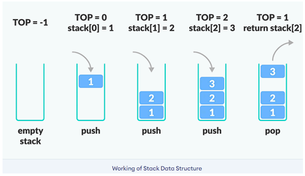
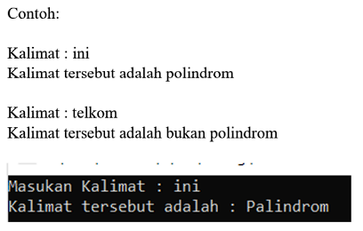
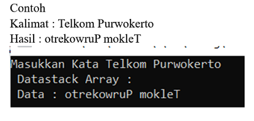

# <h1 align="center">Laporan Praktikum Modul Stack</h1>

<p align="center">Nandana Tsany Farrel Arkananta - 2311102143</p>

## Dasar Teori

#### Pengertian Stack

Stack adalah struktur data sederhana yang digunakan untuk menyimpan data (mirip dengan Linked Lists). Dalam tumpukan, urutan kedatangan data penting. Sebuah tumpukan piring di kafetaria adalah contoh bagus dari tumpukan. Piring ditambahkan ke tumpukan saat mereka dibersihkan dan ditempatkan di bagian atas. Ketika sebuah piring dibutuhkan, diambil dari bagian atas tumpukan. Piring pertama yang ditempatkan di tumpukan adalah yang terakhir digunakan.

Definisi: Sebuah tumpukan adalah daftar terurut di mana penyisipan dan penghapusan dilakukan di satu ujung, disebut atas. Elemen terakhir yang dimasukkan adalah yang pertama dihapus. Oleh karena itu, disebut daftar Last in First out (LIFO).



Operasi pada stack melibatkan beberapa fungsi dasar yang dapat dilakukan pada struktur data ini. Berikut adalah beberapa operasi umum pada stack:
1. Push (Masukkan): Menambahkan elemen ke dalam tumpukan pada posisi paling atas atau ujung.
2. Pop (Keluarkan): Menghapus elemen dari posisi paling atas atau ujung tumpukan.
3. Top (Atas): Mendapatkan nilai atau melihat elemen teratas pada tumpukan tanpa menghapusnya.
4. IsEmpty (Kosong): Memeriksa apakah tumpukan kosong atau tidak.
5. IsFull (Penuh): Memeriksa apakah tumpukan penuh atau tidak (terutama pada implementasi tumpukan dengan kapasitas terbatas).
6. Size (Ukuran): Mengembalikan jumlah elemen yang ada dalam tumpukan.
7. Peek (Lihat): Melihat nilai atau elemen pada posisi tertentu dalam tumpukan tanpa menghapusnya.
8. Clear (Hapus Semua): Mengosongkan atau menghapus semua elemen dari tumpukan.
9. Search (Cari): Mencari keberadaan elemen tertentu dalam tumpukan.


## Guided

```C++
#include <iostream>
using namespace std;

string arrayBuku[5];
int maksimal = 5, top = 0;
bool isFull()
{
    return (top == maksimal);
}
bool isEmpty()
{
    return (top == 0);
}
void pushArrayBuku(string data)
{
    if (isFull())
    {
        cout << "Data telah penuh" << endl;
    }
    else
    {
        arrayBuku[top] = data;
        top++;
    }
}
void popArrayBuku()
{
    if (isEmpty())
    {
        cout << "Tidak ada data yang dihapus" << endl;
    }
    else
    {
        arrayBuku[top - 1] = "";
        top--;
    }
}
void peekArrayBuku(int posisi)
{
    if (isEmpty())
    {
        cout << "Tidak ada data yang bisa dilihat" << endl;
    }
    else
    {
        int index = top;
        for (int i = 1; i <= posisi; i++)
        {
            index--;
        }
        cout << "Posisi ke " << posisi << " adalah " << arrayBuku[index] << endl;
    }
}
int countStack()
{
    return top;
}
void changeArrayBuku(int posisi, string data)
{
    if (posisi > top)
    {
        cout << "Posisi melebihi data yang ada" << endl;
    }
    else
    {
        int index = top;
        for (int i = 1; i <= posisi; i++)
        {
            index--;
        }
        arrayBuku[index] = data;
    }
}
void destroyArraybuku()
{
    for (int i = top; i >= 0; i--)
    {
        arrayBuku[i] = "";
    }
    top = 0;
}
void cetakArrayBuku()
{
    if (isEmpty())
    {
        cout << "Tidak ada data yang dicetak" << endl;
    }
    else
    {
        for (int i = top - 1; i >= 0; i--)
        {
            cout << arrayBuku[i] << endl;
        }
    }
}
int main()
{
    pushArrayBuku("Kalkulus");
    pushArrayBuku("Struktur Data");
    pushArrayBuku("Matematika Diskrit");
    pushArrayBuku("Dasar Multimedia");
    pushArrayBuku("Inggris");
    cetakArrayBuku();
    cout << "\n";
    cout << "Apakah data stack penuh? " << isFull() << endl;
    cout << "Apakah data stack kosong? " << isEmpty() << endl;
    peekArrayBuku(2);
    popArrayBuku();
    cout << "Banyaknya data = " << countStack() << endl;
    changeArrayBuku(2, "Bahasa Jerman");
    cetakArrayBuku();
    cout << "\n";
    destroyArraybuku();
    cout << "Jumlah data setelah dihapus: " << top << endl;
    cetakArrayBuku();
    return 0;
}


```

Dengan menggunakan struktur data stack untuk menyimpan dan mengelola sebuah set data. Pada awalnya, stack dimulai dengan kapasitas penuh (data stack penuh) dan kemudian diuji apakah stack kosong. Kemudian, data "Dasar Multimedia" dimasukkan sebagai posisi kedua dalam stack. Selanjutnya, dilakukan penambahan data baru "Bahasa Jerman" dan penghapusan data dari stack. Akhirnya, setelah penghapusan, tidak ada data yang dicetak karena jumlah data dalam stack menjadi 0. Langkah-langkahnya meliputi pengujian apakah stack penuh atau kosong, penambahan dan penghapusan data, serta pencetakan hasil akhir.

## Unguided

### 1. Buatlah program untuk menentukan apakah kalimat tersebut yang diinputkan dalam program stack adalah palindrom/tidak. Palindrom kalimat yang dibaca dari depan dan belakang sama. Jelaskan bagaimana cara kerja programnya.




```C++
#include <iostream>
#include <stack>
#include <string>

using namespace std;

bool isPalindrome(const string& kalimat_118) {
    stack<char> stack;
    
    // Hapus spasi dan masukkan karakter ke dalam stack
    for (char ch : kalimat_118) {
        if (ch != ' ') {
            stack.push(tolower(ch)); // Gunakan tolower untuk mengabaikan case sensitivity
        }
    }

    // Bandingkan karakter dengan urutan terbaliknya
    for (char ch : kalimat_118) {
        if (ch != ' ') {
            if (stack.empty() || tolower(ch) != stack.top()) {
                return false;
            }
            stack.pop();
        }
    }

    return true;
}

int main() {
    string kalimat_118;
    cout << "Masukan Kalimat: ";
    getline(cin, kalimat_118); // Menggunakan getline untuk membaca spasi

    if (isPalindrome(kalimat_118)) {
        cout << "Kalimat tersebut adalah: Palindrom" << endl;
    } else {
        cout << "Kalimat tersebut adalah bukan Palindrom" << endl;
    }

    return 0;
}

```

## Output:


Code di atas mengimplementasikan sebuah program untuk menentukan apakah sebuah kalimat merupakan palindrom atau tidak menggunakan struktur data stack. Pertama, program meminta pengguna memasukkan kalimat. Kemudian, program menghapus spasi dari kalimat dan memasukkan karakter-karakternya ke dalam stack. Setelah itu, program membandingkan karakter-karakter dalam kalimat dengan urutan terbaliknya, menggunakan stack. Jika semua karakter cocok dengan urutan terbaliknya, maka kalimat tersebut dianggap sebagai palindrom dan pesan "Kalimat tersebut adalah Palindrom" dicetak. Jika tidak, pesan "Kalimat tersebut adalah bukan Palindrom" dicetak. Langkah-langkahnya mencakup penghapusan spasi, penyimpanan karakter ke dalam stack, dan pembandingan karakter dengan urutan terbaliknya menggunakan stack.


### 2.Buatlah program untuk melakukan pembalikan terhadap kalimat menggunakan stack dengan minimal 3 kata. Jelaskan output program dan source codenya beserta operasi/fungsi yang dibuat?



```C++
#include <iostream>
#include <stack>
#include <string>

using namespace std;

void reverseSentence(string sentence_118) {
    stack<char> charStack;

    // Push characters of the sentence onto the stack
    for (char c : sentence_118) {
        charStack.push(c);
    }

    // Pop and print characters from the stack
    cout << "Reversed Sentence: ";
    while (!charStack.empty()) {
        cout << charStack.top();
        charStack.pop();
    }
    cout << endl;
}

int main() {
    string sentence_118;
    cout << "Masukkan kalimat: ";
    getline(cin, sentence_118);
    reverseSentence(sentence_118);
    return 0;
}
```

## Output


## Kesimpulan

Praktikum ini telah memperkenalkan konsep Hash Table, sebuah struktur data yang efisien untuk menyimpan dan mencari data. Hash Table menggunakan teknik hashing untuk mengatur data ke dalam array, memungkinkan akses data secara cepat. Saat terjadi collision, yaitu ketika dua kunci menghasilkan nilai hash yang sama, digunakan teknik chaining dengan linked list.

Dalam praktikum, kita belajar tentang operasi dasar Hash Table seperti menambah, menghapus, dan mencari data. Selain itu, teknik-teknik seperti linear probing, quadratic probing, dan double hashing digunakan untuk menangani collision.

Praktikum ini juga mengimplementasikan Hash Table untuk menyimpan informasi mahasiswa seperti nama, NIM, dan nilai. Dengan pemahaman yang baik tentang Hash Table dan cara menangani collision, kita dapat mengelola data secara efisien dalam berbagai aplikasi pemrograman. Ini memberikan pemahaman yang mendalam tentang penggunaan Hash Table dalam penyimpanan dan pencarian data.

## Referensi

[1] Karumanchi, N. (2016). Data Structures and algorithms made easy: Concepts, problems, Interview Questions. CareerMonk Publications.
[2] S Subandijo. (2012) Perbandingan Antara C++ dan Java dalam Pengelolaan Sumber. Journal.binus.id
[3] Annisa, September 19, 2023, "Struktur Data Hash Table: Pengertian, Cara Kerja dan Operasi Hash Table".
