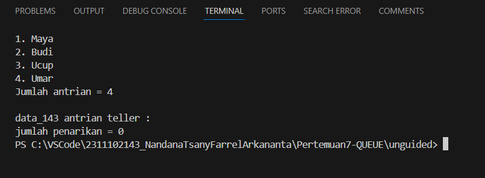
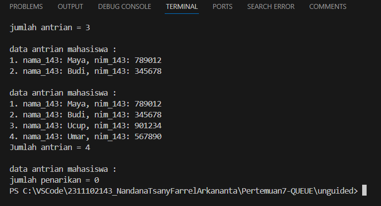

# <h1 align="center">Laporan Praktikum Modul QUEUE</h1>

<p align="center">Nandana Tsany Farrel Arkananta - 2311102143</p>

## Dasar Teori

#### Pengertian Stack

    Queue atau antrian adalah sekumpulan data pada penambahan elemen hanya bisa dilakukan pada suatu ujung disebut dengan sisi belakang (rear), dan penghapusan (pengambilan elemen) yang dilakukan lewat ujung lain. Pada Stack atau tumpukan mengguanakan prinsip LIFO (Last In First Out), namun pada Queue atau antrian mengguanakan prinsip yang digunakan FIFO (First In First Out) Queue atau antrian sering ditemui dalam kehidupan sehari-hari, seperti: mobil diloket tol, antrian orang belanja, pemakaian sistem computer berbagi waktu (time-sharing computer system) sejumlah pemakai akan menggunakan sistem tersebut secara serempak. Pada sebuah queue atau antrian terdapat satu buah pintu masuk di suatu ujung dan satu buah pintu keluar di ujung satunya yang membutuhkan variable Head dan Tail.


Operasi pada Queue :
1. Create()
Untuk menciptakan dan menginisialisasi Queue
2. IsEmpty()
Untuk memeriksa apakah antrian masih kosong
3. Enqueue()
Untuk menambahkan elemen pada antiran, penambahan elemen selalu ditambahkan di elemen paling belakang
4. Dequeue()
Digunakan untuk menghapus elemen terdepan/pertama (head) dari antrian
5. Clear()
Untuk menghapus elemen-elemen antrian dengan cara membuat Tail dan Head = -1
6. Tampil()
Untuk menampilkan nilai-nilai elemen antrian


## Guided

```C++
#include <iostream>
using namespace std;

int maksimalQueue = 5;
int font = 0;
int back = 0;
string queueTeller[5];

//fungsi pengecekan
bool isfull(){
    return (back == maksimalQueue);
}

//fungsi pengecekan
bool isEmpty(){
    return (back==0);
}

//fungsi menambahkan antrian
void enqueueAntrian(string data){
    if(!isfull()){
        cout<< "antrian penuh" <<endl;
    }else{
        if (isEmpty()) {
            queueTeller[0] = data;
            font++;
            back++;
        }else{
            queueTeller[back] = data;
            back++;
        }
    }
}

//fungsi mengurangi antrian
void  dequeueAntrian(){
    if (isEmpty()) {
        cout<< "antrian kosong" <<endl;
    }else {
        for (int i = 0; i < back; i++) {
            queueTeller[i] = queueTeller[i+1];
        }
        back--;
    }
}

//fungsi menghitung banyak antrian
int countQueue(){
    return back;
}

//fungsi menghapus semua antrian
void clearQueue(){
    if (isEmpty()) {
        cout<< "antrian kosong" <<endl;
    } else {
        for (int i = 0; i < back; i++) {
            queueTeller[i] = "";
        }
        back = 0;
        font = 0;
    }
}

//fungsi melihat antrian
void viewQueue(){
    cout<< "data antrian teller : " <<endl;
    for (int i= 0; i < maksimalQueue; i++) {
        if (queueTeller[i] != "") {
            cout<< i + 1 << ". " << queueTeller[i] <<endl;
    } else {
        cout << i + 1 << ". " << "kosong" <<endl;
         }
    }
}

int main() {
    enqueueAntrian("Andi");
    enqueueAntrian("Maya");
    enqueueAntrian("Budi");
    viewQueue();
    cout<< "jumlah antrian = " << countQueue() << endl;
    cout<<endl;

    dequeueAntrian();
    viewQueue();
    cout<<endl;

    enqueueAntrian("Ucup");
    enqueueAntrian("Umar");
    viewQueue();
    cout<< "Jumlah antrian = " << countQueue() << endl;
    cout<<endl;

    clearQueue();
    viewQueue();
    cout<< "jumlah penarikan = " << countQueue() <<endl;

    return 0;
}

```

Program ini adalah struktur data antrian (queue) yang mengguanakan array
string. Antrian ini memiliki kapasitas maksimal 5 elemen, dan digunakan
untuk menyimpan data-data nama_143 orang.
Program ini memiliki beberapa fungsi yaitu :
1. IsFull Fungsi ini digunakan untuk memeriksa apaah antrian telah penuh atau belum.
2. IsFull Fungsi ini digunakan untuk memeriksa apakah antrian kosong atau tidak.
3. enqueueAntrian Fungsi ini digunakan untuk menambahkan data ke antrian. Jika antrian telah penuh maka akan menampilkan “antrian penuh”.
4. dequeueAntrian(): Fungsi ini digunakan untuk mengurangi data dari antrian. Jika antrian kosong, maka akan menampilkan pesan "antrian kosong".
5. countQueue(): Fungsi ini digunakan untuk menghitung jumlah data di antrian.
6. clearQueue(): Fungsi ini digunakan untuk menghapus semua data dari antrian.
7. viewQueue(): Fungsi ini digunakan untuk menampilkan data-data yang ada di antrian.

Di bagian main(), program ini melakukan beberapa operasi pada antrian, yaitu:
1. Menambahkan data "Andi", "Maya", dan "Budi" ke antrian.
2. Menampilkan data antrian menggunakan viewQueue().
3. Mengurangi data dari antrian menggunakan dequeueAntrian()
4. Menambahkan data "Ucup" dan "Umar" ke antrian.
5. Menghapus semua data dari antrian menggunakan clearQueue().

## Unguided

### 1. Ubahlah penerapan konsep queue pada bagian guided dari array menjadi linked list

```C++
#include <iostream>
using namespace std;

// definisikan node
struct Node {
    string nama_143;
    string nim_143;
    Node* next;
};

// definisikan queue
class Queue {
public:
    Queue() : head(nullptr), tail(nullptr), size(0) {}

    // fungsi pengecekan
    bool isEmpty() {
        return size == 0;
    }

    // fungsi pengecekan
    bool isFull() {
        return false; // linked list tidak memiliki kapasitas maksimum
    }

    // fungsi menambahkan antrian
    void enqueue(string nama_143, string nim_143) {
        Node* newNode = new Node;
        newNode->nama_143 = nama_143;
        newNode->nim_143 = nim_143;
        newNode->next = nullptr;

        if (isEmpty()) {
            head = newNode;
            tail = newNode;
        } else {
            tail->next = newNode;
            tail = newNode;
        }
        size++;
    }

    // fungsi mengurangi antrian
    void dequeue() {
        if (isEmpty()) {
            cout << "antrian kosong" << endl;
        } else {
            Node* tempNode = head;
            head = head->next;
            delete tempNode;
            size--;
        }
    }

    // fungsi menghitung banyak antrian
    int count() {
        return size;
    }

    // fungsi menghapus semua antrian
    void clear() {
        while (!isEmpty()) {
            dequeue();
        }
    }

    // fungsi melihat antrian
    void view() {
        Node* currentNode = head;
        int i = 1;

        cout << "data antrian mahasiswa : " << endl;
        while (currentNode != nullptr) {
            cout << i++ << ". nama_143: " << currentNode->nama_143 << ", nim_143: " << currentNode->nim_143 << endl;
            currentNode = currentNode->next;
        }
    }

private:
    Node* head;
    Node* tail;
    int size;
};

int main() {
    Queue queueMahasiswa;

    queueMahasiswa.enqueue("Andi", "123456");
    queueMahasiswa.enqueue("Maya", "789012");
    queueMahasiswa.enqueue("Budi", "345678");
    queueMahasiswa.view();
    cout << "jumlah antrian = " << queueMahasiswa.count() << endl;
    cout << endl;

    queueMahasiswa.dequeue();
    queueMahasiswa.view();
    cout << endl;

    queueMahasiswa.enqueue("Ucup", "901234");
    queueMahasiswa.enqueue("Umar", "567890");
    queueMahasiswa.view();
    cout << "Jumlah antrian = " << queueMahasiswa.count() << endl;
    cout << endl;

    queueMahasiswa.clear();
    queueMahasiswa.view();
    cout << "jumlah penarikan = " << queueMahasiswa.count() << endl;

    return 0;
}

```

## Output:



Program ini adalah struktur data antrian (queue) menggunakan linked
list. Antrian ini dapat menambahkan, mengurangi, dan menghapus data
dengan benar.
Program ini terdiri dari dua bagian utama: Node dan Queue
1. Struct Node dapat merepresentasikan sebuah elemen dalam linked list. Setiap node memiliki dua atribut: data_118 untuk menyimpan data string, dan next_118 untuk menyimpan pointer ke node berikutnya dalam linked list.
2. Class Queue merepresentasikan antrian itu sendiri. Queue memiliki tiga atribut: head untuk menyimpan pointer ke node pertama dalam linked list, tail untuk menyimpan pointer ke node terakhir dalam linked list, dan size untuk menyimpan jumlah elemen dalam antrian.

Di bagian main(), program ini melakukan beberapa operasi pada
antrian, yaitu:
1. Menambahkan data "Andi", "Maya", dan "Budi" ke antrian.
2. Menampilkan data antrian menggunakan view().
3. Menghitung jumlah data antrian menggunakan count().
4. Mengurangi data dari antrian menggunakan dequeue().
5. Menambahkan data "Ucup" dan "Umar" ke antrian.
6. Menghapus semua data dari antrian menggunakan clear().

### 2.Dari nomor 1 buatlah konsep antri dengan atribut Nama mahasiswa dan NIM Mahasiswa

```C++
#include <iostream>
using namespace std;

// definisikan node
struct Node {
    string nama_143;
    string nim_143;
    Node* next;
};

// definisikan queue
class Queue {
public:
    Queue() : head(nullptr), tail(nullptr), size(0) {}

    // fungsi pengecekan
    bool isEmpty() {
        return size == 0;
    }

    // fungsi pengecekan
    bool isFull() {
        return false; // linked list tidak memiliki kapasitas maksimum
    }

    // fungsi menambahkan antrian
    void enqueue(string nama_143, string nim_143) {
        Node* newNode = new Node;
        newNode->nama_143 = nama_143;
        newNode->nim_143 = nim_143;
        newNode->next = nullptr;

        if (isEmpty()) {
            head = newNode;
            tail = newNode;
        } else {
            tail->next = newNode;
            tail = newNode;
        }
        size++;
    }

    // fungsi mengurangi antrian
    void dequeue() {
        if (isEmpty()) {
            cout << "antrian kosong" << endl;
        } else {
            Node* tempNode = head;
            head = head->next;
            delete tempNode;
            size--;
        }
    }

    // fungsi menghitung banyak antrian
    int count() {
        return size;
    }

    // fungsi menghapus semua antrian
    void clear() {
        while (!isEmpty()) {
            dequeue();
        }
    }

    // fungsi melihat antrian
    void view() {
        Node* currentNode = head;
        int i = 1;

        cout << "data antrian mahasiswa : " << endl;
        while (currentNode != nullptr) {
            cout << i++ << ". nama_143: " << currentNode->nama_143 << ", nim_143: " << currentNode->nim_143 << endl;
            currentNode = currentNode->next;
        }
    }

private:
    Node* head;
    Node* tail;
    int size;
};

int main() {
    Queue queueMahasiswa;

    queueMahasiswa.enqueue("Andi", "123456");
    queueMahasiswa.enqueue("Maya", "789012");
    queueMahasiswa.enqueue("Budi", "345678");
    queueMahasiswa.view();
    cout << "jumlah antrian = " << queueMahasiswa.count() << endl;
    cout << endl;

    queueMahasiswa.dequeue();
    queueMahasiswa.view();
    cout << endl;

    queueMahasiswa.enqueue("Ucup", "901234");
    queueMahasiswa.enqueue("Umar", "567890");
    queueMahasiswa.view();
    cout << "Jumlah antrian = " << queueMahasiswa.count() << endl;
    cout << endl;

    queueMahasiswa.clear();
    queueMahasiswa.view();
    cout << "jumlah penarikan = " << queueMahasiswa.count() << endl;

    return 0;
}
```

## Output



Program ini struktur data antrian (queue) menggunakan linked list. Antrian ini dapat menambahkan, mengurangi, dan menghapus data dengan benar.
Program ini terdiri dari dua bagian utama: Node dan Queue.
1. Struct Node dapat merepresentasikan sebuah elemen dalam
linked list. Setiap node memiliki dua atribut: nama_118 untuk
menyimpan nama mahasiswa, nim_118 untuk menyimpan NIM
mahasiswa, dan next_118 untuk menyimpan pointer ke node
berikutnya dalam linked list.

2. Class Queue dapat merepresentasikan antrian itu sendiri.
Queue memiliki tiga atribut: head untuk menyimpan pointer ke
node pertama dalam linked list, tail untuk menyimpan pointer
ke node terakhir dalam linked list, dan size untuk menyimpan
jumlah elemen dalam antrian.

Di bagian main(), program ini melakukan beberapa operasi pada
antrian, yaitu:
1. Menambahkan data "Andi", "Maya", dan "Budi" ke antrian.
2. Menampilkan data antrian menggunakan view().
3. Menghitung jumlah data antrian menggunakan count().
4. Mengurangi data dari antrian menggunakan dequeue().
5. Menambahkan data "Ucup" dan "Umar" ke antrian.
6. Menghapus semua data dari antrian menggunakan clear().

## Kesimpulan

Praktikum ini telah memperkenalkan konsep Queue, Queue (antrian) adalah struktur data linear yang mengikuti prinsip FIFO (First In First Out), yaitu elemen pertama yang masuk ke antrian akan menjadi elemen pertama yang keluar dari antrian. Queue dapat dijelaskan menggunakan array atau linked list. Dalam penjealasan queue menggunakan array, mahasiswa perlu menentukan kapasitas maksimum antrian, sedangkan dalam implementasi queue menggunakan linked list, mahasiswa tidak perlu menentukan kapasitas maksimum antrian. Fungsi-fungsi yang umumnya ada dalam queue adalah enqueue (menambahkan elemen ke antrian), dequeue (menghapus elemendari antrian), isEmpty (memeriksa apakah antrian kosong), isFull (memeriksa apakah antrian penuh), count (menghitung jumlah elemen dalam antrian), dan clear (menghapus semua elemen dalam antrian).

## Referensi

[1] Karumanchi, N. (2016). Data Structures and algorithms made easy: Concepts, problems, Interview Questions. CareerMonk Publications.
[2] S Subandijo. (2012) Perbandingan Antara C++ dan Java dalam Pengelolaan Sumber. Journal.binus.id
[3] S Subandijo - ComTech: Computer, Mathematics and Engineering Applications, 2012 - journal.binus.ac.id
