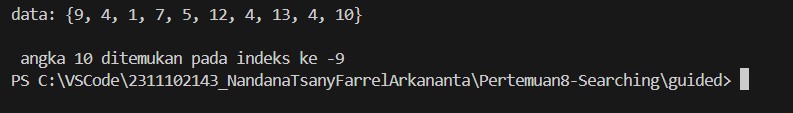
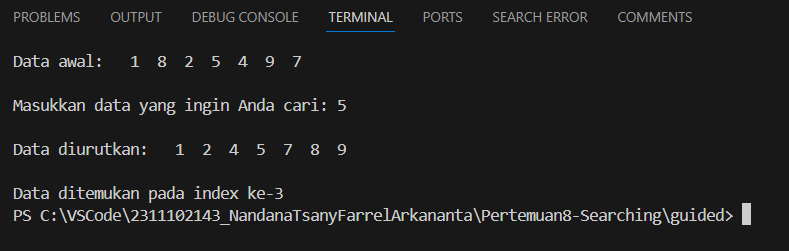
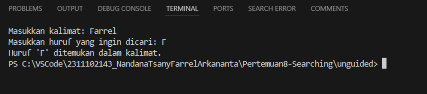
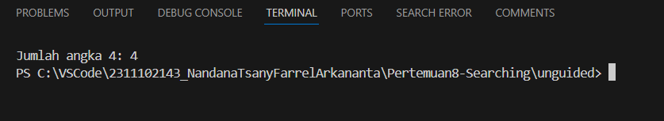

# <h1 align="center">Laporan Praktikum Modul Searching</h1>

<p align="center">Nandana Tsany Farrel Arkananta - 2311102143</p>

## Dasar Teori

#### Pengertian Stack

Binary Search merupakan metode pencarian yang digunakan pada data yang sudah terurut secara urut. Algoritma ini bekerja dengan membagi data menjadi dua bagian, kemudian memeriksa elemen tengahnya untuk menentukan apakah data yang dicari berada di bagian kiri atau kanan. Proses ini berulang hingga data yang dicari ditemukan. Prinsip dasar dari Binary Search adalah "Divide and Conquer", di mana ruang pencarian data dibagi menjadi bagian-bagian kecil untuk mempercepat proses pencarian. Kelebihan dari Binary Search adalah efisiensi dalam mencari data dalam jumlah besar dengan menggunakan sedikit beban komputasi. Algoritma ini cocok digunakan pada data yang sudah terurut.

Regular Search Expression (REGEX) adalah metode pencarian string yang tidak hanya mencari string secara spesifik, tetapi juga berdasarkan pola dari string tersebut. Algoritma ini memungkinkan pencarian berdasarkan pola tertentu dalam data. REGEX berbasis pada konsep Finite Automaton, di mana pencarian dilakukan dengan membentuk keadaan/state dan grafik berarah yang merepresentasikan karakter-karakter dalam string yang dicari. Kelebihan dari Regular Search Expression adalah kemampuannya untuk mencari data berdasarkan pola tertentu tanpa perlu data yang sudah diurutkan. Algoritma ini efektif dalam mengeksekusi setiap karakter dengan waktu konstan. Dengan pemahaman dasar teori dari Binary Search dan Regular Search Expression, pengguna dapat memilih metode pencarian yang sesuai dengan kebutuhan dan karakteristik data yang akan dicari.


## Guided

#### 1. Buatlah sebuah project dengan menggunakan sequential search sederhana untuk melakukan pencarian data.
```C++
#include <iostream>
using namespace std;
int main()
{
    int n = 10;
    int data[n] = {9, 4, 1, 7, 5, 12, 4, 13, 4, 10};
    int cari = 10;
    bool ketemu = false;
    int i;
    // algoritma Sequential Search
    for (i = 0; i < n; i++)
    {
        if (data[i] == cari)
        {
            ketemu = true;
            break;
        }
    }
    cout << "\t Program Sequential Search Sederhana\n " << endl;
    cout << "data: {9, 4, 1, 7, 5, 12, 4, 13, 4, 10}" << endl;
    if (ketemu)
    {
        cout << "\n angka " << cari << " ditemukan pada indeks ke -" << i << endl;
    }
    else
    {
        cout << cari << " tidak dapat ditemukan pada data." << endl;
    }
    return 0;
}

```
### Output 



Program ini adalah penjelasan dari algoritma pencarian linear sederhana. Program ini
mencari angka 10 dalam array data yang berisi 10 angka acak. Jika angka 10
ditemukan, program akan menampilkan indeks ke-nya. Jika tidak ditemukan, program
akan menampilkan pesan "tidak dapat ditemukan pada data"


#### 2. Buatlah sebuah project untuk melakukan pencarian data dengan menggunakan Binary Search.

```C++
#include <iostream>
#include <iomanip>
using namespace std;
// Deklarasi array dan variabel untuk pencarian
int arrayData[7] = {1, 8, 2, 5, 4, 9, 7};
int cari;
void selection_sort(int arr[], int n)
{
    int temp, min;
    for (int i = 0; i < n - 1; i++)
    {
        min = i;
        for (int j = i + 1; j < n; j++)
        {
            if (arr[j] < arr[min])
            {
                min = j;
            }
        }
        // Tukar elemen
        temp = arr[i];
        arr[i] = arr[min];
        arr[min] = temp;
    }
}
void binary_search(int arr[], int n, int target)
{
    int awal = 0, akhir = n - 1, tengah, b_flag = 0;
    while (b_flag == 0 && awal <= akhir)
    {
        tengah = (awal + akhir) / 2;
        if (arr[tengah] == target)
        {
            b_flag = 1;
            break;
        }
        else if (arr[tengah] < target)
        {
            awal = tengah + 1;
        }
        else
        {
            akhir = tengah - 1;
        }
    }
    if (b_flag == 1)
        cout << "\nData ditemukan pada index ke-" << tengah << endl;
    else
        cout << "\nData tidak ditemukan\n";
}
int main()
{
    cout << "\tBINARY SEARCH" << endl;
    cout << "\nData awal: ";
    // Tampilkan data awal
    for (int x = 0; x < 7; x++)
    {
        cout << setw(3) << arrayData[x];
    }
    cout << endl;
    cout << "\nMasukkan data yang ingin Anda cari: ";
    cin >> cari;
    // Urutkan data dengan selection sort
    selection_sort(arrayData, 7);
    cout << "\nData diurutkan: ";
    // Tampilkan data setelah diurutkan
    for (int x = 0; x < 7; x++)
    {
        cout << setw(3) << arrayData[x];
    }
    cout << endl;
    // Lakukan binary search
    binary_search(arrayData, 7, cari);
    return 0;
}
```

### Output


Program ini adalah algoritma pencarian binary search. Program ini mencari sebuah
bilangan bulat yang telah diinput oleh pengguna pada array yang telah diurutkan
menggunakan selection sort. Jika bilangan bulat yang dicari ditemukan, program akan
menampilkan indeks dari bilangan bulat tersebut. Jika tidak ditemukan, program akan
menampilkan pesan "Data tidak ditemukan".


## Unguided

### 1. Buatlah sebuah program untuk mencari sebuah huruf pada sebuah kalimat yang sudah di input dengan menggunakan Binary Search!

```C++
#include <iostream>
#include <string>

using namespace std;

// Fungsi untuk mencari huruf dalam kalimat dengan Binary Search
bool binarySearch(string kalimat_143, char hurufDicari_143) {
  // Inisialisasi indeks awal dan akhir
  int low_143 = 0;
  int high_143 = kalimat_143.length() - 1;

  // Looping selama indeks awal lebih kecil dari atau sama dengan indeks akhir
  while (low_143 <= high_143) {
    // Hitung indeks tengah
    int mid = (low_143 + high_143) / 2;

    // Periksa apakah huruf di indeks tengah sama dengan huruf yang dicari
    if (kalimat_143[mid] == hurufDicari_143) {
      // Huruf ditemukan, kembalikan true
      return true;
    } else if (kalimat_143[mid] < hurufDicari_143) {
      // Huruf yang dicari lebih besar, perbarui indeks awal
      low_143 = mid + 1;
    } else {
      // Huruf yang dicari lebih kecil, perbarui indeks akhir
      high_143 = mid - 1;
    }
  }

  // Huruf tidak ditemukan, kembalikan false
  return false;
}

int main() {
  // Deklarasi variabel untuk kalimat dan huruf yang dicari
  string kalimat_143;
  char hurufDicari_143;

  // Minta input kalimat dari pengguna
  cout << "Masukkan kalimat: ";
  getline(cin, kalimat_143);

  // Minta input huruf yang dicari dari pengguna
  cout << "Masukkan huruf yang ingin dicari: ";
  cin >> hurufDicari_143;

  // Panggil fungsi binarySearch untuk mencari huruf
  bool ditemukan = binarySearch(kalimat_143, hurufDicari_143);

  // Tampilkan pesan berdasarkan hasil pencarian
  if (ditemukan) {
    cout << "Huruf '" << hurufDicari_143 << "' ditemukan dalam kalimat." << endl;
  } else {
    cout << "Huruf '" << hurufDicari_143 << "' tidak ditemukan dalam kalimat." << endl;
  }

  return 0;
}
```

## Output:


Program ini adalah algoritma pencarian menggunakan binary search untuk
mencari sebuah huruf dalam kalimat. Jika user menginput sebuah kalimat kata atau
kalimat kemudian user diminta akan menginput huruf yang akan dicari, lalu program
akan mencari huruf yang diinput user dan hasil huruf yang dicari akan muncul dalam
program.

### 2.Buatlah sebuah program yang dapat menghitung banyaknya huruf vocal dalam sebuah kalimat menggunakan algoritma searching!

```C++
#include <iostream>
#include <string>

using namespace std;

// Fungsi untuk menghitung jumlah huruf vokal dalam kalimat
int HitungVokal(string kalimat_143)
{
    // Inisialisasi variabel penghitung
    int count = 0;

    // Looping melalui setiap karakter dalam kalimat
    for (int i = 0; i < kalimat_143.length(); i++)
    {
        // Mendapatkan karakter saat ini
        char huruf_143 = kalimat_143[i];

        // Memeriksa apakah karakter adalah huruf vokal
        if (huruf_143 == 'a' || huruf_143 == 'A' ||
            huruf_143 == 'e' || huruf_143 == 'E' ||
            huruf_143 == 'i' || huruf_143 == 'I' ||
            huruf_143 == 'o' || huruf_143 == 'O' ||
            huruf_143 == 'u' || huruf_143 == 'U')
        {
            // Jika vokal, tambahkan ke penghitung
            count++;
        }
    }

    // Mengembalikan jumlah vokal
    return count;
}

int main()
{
    // Deklarasi variabel untuk kalimat
    string kalimat_143;

    // Minta input kalimat dari pengguna
    cout << "Masukkan kalimat: ";
    getline(cin, kalimat_143);

    // Panggil fungsi untuk menghitung vokal
    int jumlahVokal = HitungVokal(kalimat_143);

    // Tampilkan hasil penghitungan
    cout << "Jumlah huruf vokal dalam kalimat: " << jumlahVokal << endl;

    return 0;
}
```

## Output


Program ini adalah fungsi untuk menghitung jumlah huruf vokal didalam
kalimat. Jika user menginput kalimat atau kata maka didalam program akan muncul
jumlah huruf vokal yang ada di dalam kalimat seperti screenshoot program diatas.

### 3. Diketahui data = 9, 4, 1, 4, 7, 10, 5, 4, 12, 4. Hitunglah berapa banyak angka 4 dengan menggunakan algoritma Sequential Search!

```C++
#include <iostream>

using namespace std;

int main() {
  // Data yang diberikan
  int data_143[] = {9, 4, 1, 4, 7, 10, 5, 4, 12, 4};
  int n = sizeof(data_143) / sizeof(data_143[0]); // Jumlah elemen dalam data

  // Inisialisasi variabel untuk menghitung angka 4
  int count = 0;

  // Algoritma sequential search
  for (int i = 0; i < n; i++) {
    if (data_143[i] == 4) {
      count++; // Hitung angka 4
    }
  }

  // Hasil
  cout << "Jumlah angka 4: " << count << endl;

  return 0;
}
```
## Output


Program ini adalah algoritma sequential search untuk mencari dan menghitung jumlah
kemunculan sebuah bilangan tertentu, yaitu angka 4, pada array. Program akan
menampilkan jumlah kemunculan angka 4 yang telah dihitung

## Kesimpulan

Praktikum ini telah memperkenalkan konsep Binary Search dan Squential Search.
Algoritma searching adalah langkah-langkah yang digunakan untuk mencari suatu nilai
atau elemen tertentu pada struktur data tertentu. Ada beberapa jenis algoritma searching,
yaitu sequential search, binary search. Sequential search adalah algoritma searching
yang mudah dipahami, tetapi tidak efisien jika jumlah elemen pada struktur data besar.
Binary search adalah algoritma searching yang lebih efisien dibandingkan sequential
search, tetapi membutuhkan struktur data yang terurut.

## Referensi

[1] Karumanchi, N. (2016). Data Structures and algorithms made easy: Concepts, problems, Interview Questions. CareerMonk Publications.
[2] Fenina Adline Twince Tobing, Rena Nainggolan, ANALISIS PERBANDINGAN PENGGUNAAN METODE BINARY SEARCH DENGAN REGULAR SEARCH EXPRESSION, Vol. 4, No. 2, 168-172, Oktober 2020.

