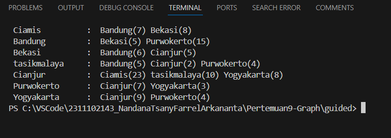
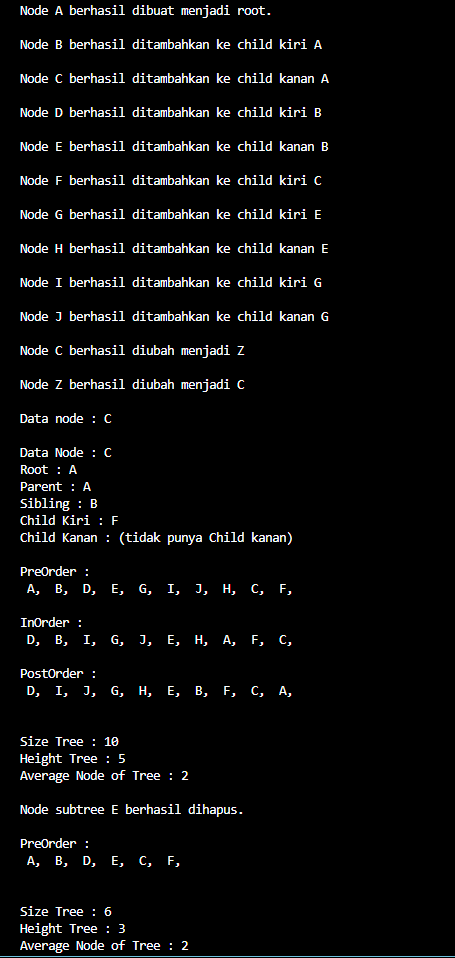
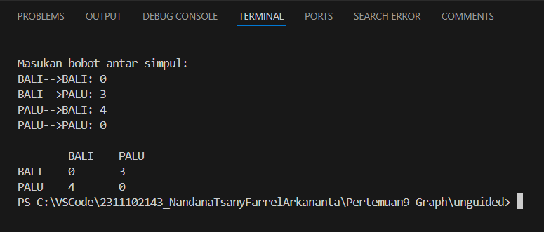
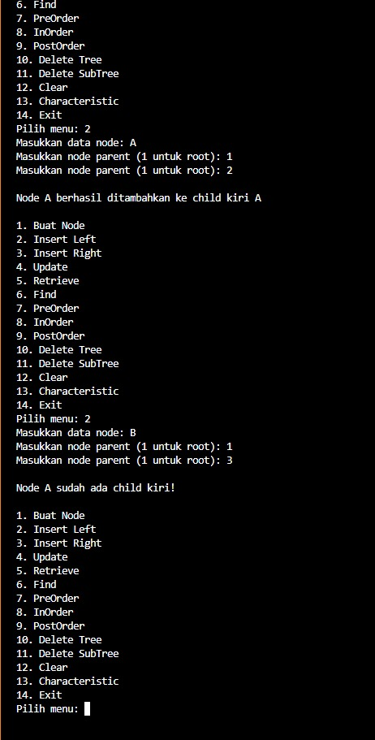

# <h1 align="center">Laporan Praktikum Modul Graph</h1>

<p align="center">Nandana Tsany Farrel Arkananta - 2311102143</p>

## Dasar Teori

#### Pengertian Graph

Dalam pemrograman, Tree (Pohon) dan Graph (Graf) adalah dua struktur data penting yang digunakan dalam berbagai aplikasi dan algoritma. Berikut ini adalah penjelasan dasar mengenai Tree dan Graph dalam konteks pemrograman:

**Tree (Pohon):**

1. **Struktur Data Pohon**: Pohon adalah struktur data yang berbentuk hierarkis dan terdiri dari simpul-simpul yang saling terhubung. Setiap simpul (node) memiliki satu simpul induk (parent) dan dapat memiliki satu atau lebih simpul anak (children).

2. **Representasi Pohon**: Pohon sering direpresentasikan menggunakan struktur data berantai (linked structure) atau array. Salah satu jenis pohon yang paling umum digunakan adalah pohon biner, di mana setiap simpul memiliki paling banyak dua anak.

3. **Operasi pada Pohon**: Operasi yang umum dilakukan pada pohon meliputi:
   - **Penelusuran Pohon (Traversal)**: In-order, pre-order, dan post-order traversal.
   - **Pencarian**: Mencari simpul dengan nilai tertentu.
   - **Penambahan Simpul**: Menambahkan simpul baru ke dalam pohon.
   - **Penghapusan Simpul**: Menghapus simpul dari pohon.
   - **Rotasi Pohon**: Digunakan dalam pohon-pohon seimbang seperti AVL atau pohon merah-hitam (red-black tree).

4. **Aplikasi dalam Pemrograman**: Pohon digunakan dalam implementasi berbagai struktur data seperti pohon pencarian biner (binary search tree), pohon merah-hitam (red-black tree), pohon B (B-tree), dan pohon heap. Mereka digunakan untuk penyimpanan data terstruktur dan operasi pencarian yang efisien.

**Graph (Graf):**

1. **Representasi Graf**: Graf direpresentasikan dalam pemrograman menggunakan matriks ketetanggaan (adjacency matrix) atau daftar ketetanggaan (adjacency list). Representasi ini menggambarkan hubungan antara simpul-simpul dalam graf.

2. **Algoritma Graf**: Berbagai algoritma digunakan dalam pemrograman graf, seperti:
   - **Algoritma Pencarian Jalur Terpendek**: Misalnya, algoritma Dijkstra atau Bellman-Ford.
   - **Algoritma Pencarian Komponen Terhubung**: Misalnya, algoritma DFS atau BFS untuk menemukan semua komponen terhubung dalam graf.
   - **Algoritma Pencarian Lintasan**: Misalnya, algoritma A* untuk pencarian lintasan.
   - **Algoritma Alur Maksimum**: Misalnya, algoritma Ford-Fulkerson untuk mencari aliran maksimum dalam graf jaringan.

3. **Jenis Graf**: 
   - **Graf Berarah (Directed Graph)**: Merepresentasikan hubungan satu arah.
   - **Graf Tak Berarah (Undirected Graph)**: Merepresentasikan hubungan dua arah.

4. **Aplikasi dalam Pemrograman**: Graf digunakan dalam berbagai aplikasi seperti pemodelan jaringan sosial, rute perjalanan, pemetaan sirkuit elektronik, optimisasi jaringan, dan analisis data.

Dengan pemahaman dasar ini, pengembang dapat memilih dan menggunakan struktur data serta algoritma yang sesuai untuk menyelesaikan berbagai masalah pemrograman yang melibatkan struktur hierarkis dan hubungan antar entitas.

## Guided

#### 1. Guided I Program Graph
```C++
#include <iostream> 
#include <iomanip> 
using namespace std; 
 
string simpul[7] = { 
    "Ciamis",  
    "Bandung",  
    "Bekasi",  
    "tasikmalaya", 
    "Cianjur",  
    "Purwokerto",  
    "Yogyakarta"  
}; 
 
int busur[7][7] = { 
    {0, 7, 8, 0, 0, 0, 0}, 
    {0, 0, 5, 0, 0, 15, 0}, 
    {0, 6, 0, 0, 5, 0, 0}, 
    {0, 5, 0, 0, 2, 4, 0}, 
    {23, 0, 0, 10, 0, 0, 8}, 
    {0, 0, 0, 0, 7, 0, 3}, 
    {0, 0, 0, 0, 9, 4, 0} 
}; 
 
void tampilGraph(){ 
    for (int baris = 0; baris <7; baris ++){ 
        cout <<" " << setiosflags (ios::left)<<setw (15) 
        << simpul [baris] << " : "; 
        for (int kolom = 0; kolom<7; kolom++){ 
            if (busur[baris][kolom]!=0){ 
                cout << " " << simpul[kolom]<< "(" << busur[baris][kolom] 
<< ")"; 
            } 
        } 
        cout << endl; 
    }       
} 
 
int main(){ 
    tampilGraph(); 
    return 0; 
}
```
### Output 


Kode C++ yang diberikan mendefinisikan sebuah graf menggunakan matriks ketetanggaan untuk merepresentasikan koneksi antara berbagai simpul (atau vertex). Berikut adalah penjelasan mengenai apa yang dilakukan oleh kode tersebut:

1. **Nama Simpul dan Matriks Ketetanggaan:**
   - Array `simpul` berisi nama dari tujuh simpul: "Ciamis," "Bandung," "Bekasi," "Tasikmalaya," "Cianjur," "Purwokerto," dan "Yogyakarta."
   - Array 2D `busur` (matriks ketetanggaan) merepresentasikan koneksi (edges) antara simpul-simpul tersebut. Setiap sel `busur[i][j]` berisi bobot dari edge yang menghubungkan simpul `i` ke simpul `j`. Jika `busur[i][j]` adalah nol, maka tidak ada edge langsung antara simpul-simpul tersebut.

2. **Representasi Graf:**
   - Graf ini adalah graf tak berarah (karena matriks ketetanggaan simetris).
   - Sebagai contoh, `busur[0][1]` adalah 7, yang menunjukkan bahwa ada edge dengan bobot 7 antara "Ciamis" dan "Bandung."
   - Demikian pula, `busur[1][2]` adalah 5, merepresentasikan edge antara "Bandung" dan "Bekasi."

3. **Menampilkan Graf:**
   - Fungsi `tampilGraph()` mencetak graf dalam format yang mudah dibaca.
   - Fungsi ini mengiterasi setiap baris (simpul) dan menampilkan namanya bersama dengan simpul-simpul yang bersebelahan serta bobot edge-nya.
   - Sebagai contoh, outputnya mungkin terlihat seperti ini:

     ```C++
     Ciamis       : Bandung(7) Bekasi(8)
     Bandung      : Bekasi(5) Purwokerto(15)
     Bekasi       : Ciamis(6) Cianjur(5)
     Tasikmalaya  : Ciamis(5) Cianjur(2) Purwokerto(4)
     Cianjur      : Ciamis(23) Purwokerto(10) Yogyakarta(8)
     Purwokerto   : Cianjur(7) Yogyakarta(3)
     Yogyakarta   : Cianjur(9) Purwokerto(4)
     ```

4. **Fungsi Utama:**
   - Fungsi `main()` hanya memanggil `tampilGraph()` dan mengembalikan nilai 0.


#### 2. Guided II Program Tree
```C++
#include <iostream>
using namespace std;

// PROGRAM BINARY TREE
// Deklarasi Pohon
struct Pohon
{
    char data;
    Pohon *left, *right, *parent; // pointer
};

// pointer global
Pohon *root;

// Inisialisasi
void init()
{
    root = NULL;
}

bool isEmpty()
{
    return root == NULL;
}

Pohon *newPohon(char data)
{
    Pohon *node = new Pohon();
    node->data = data;
    node->left = NULL;
    node->right = NULL;
    node->parent = NULL;
    return node;
}

void buatNode(char data)
{
    if (isEmpty())
    {
        root = newPohon(data);
        cout << "\nNode " << data << " berhasil dibuat menjadi root." << endl;
    }
    else
    {
        cout << "\nPohon sudah dibuat" << endl;
    }
}

Pohon *insertLeft(char data, Pohon *node)
{
    if (isEmpty())
    {
        cout << "\nBuat tree terlebih dahulu!" << endl;
        return NULL;
    }
    else
    {
        if (node->left != NULL)
        {
            cout << "\nNode " << node->data << " sudah ada child kiri!"
                 << endl;
            return NULL;
        }
        else
        {
            Pohon *baru = newPohon(data);
            baru->parent = node;
            node->left = baru;
            cout << "\nNode " << data << " berhasil ditambahkan ke child kiri " << node->data << endl;
            return baru;
        }
    }
}

Pohon *insertRight(char data, Pohon *node)
{
    if (isEmpty())
    {
        cout << "\nBuat tree terlebih dahulu!" << endl;
        return NULL;
    }
    else
    {
        if (node->right != NULL)
        {
            cout << "\nNode " << node->data << " sudah ada child kanan!"
                 << endl;
            return NULL;
        }
        else
        {
            Pohon *baru = newPohon(data);
            baru->parent = node;
            node->right = baru;
            cout << "\nNode " << data << " berhasil ditambahkan ke child kanan " << node->data << endl;
            return baru;
        }
    }
}

void update(char data, Pohon *node)
{
    if (isEmpty())
    {
        cout << "\nBuat tree terlebih dahulu!" << endl;
    }
    else
    {
        if (!node)
            cout << "\nNode yang ingin diganti tidak ada!!" << endl;
        else
        {
            char temp = node->data;
            node->data = data;
            cout << "\nNode " << temp << " berhasil diubah menjadi " << data << endl;
        }
    }
}

void retrieve(Pohon *node)
{
    if (isEmpty())
    {
        cout << "\nBuat tree terlebih dahulu!" << endl;
    }
    else
    {
        if (!node)
            cout << "\nNode yang ditunjuk tidak ada!" << endl;
        else
        {
            cout << "\nData node : " << node->data << endl;
        }
    }
}

void find(Pohon *node)
{
    if (isEmpty())
    {
        cout << "\nBuat tree terlebih dahulu!" << endl;
    }
    else
    {
        if (!node)
            cout << "\nNode yang ditunjuk tidak ada!" << endl;
        else
        {
            cout << "\nData Node : " << node->data << endl;
            cout << "Root : " << root->data << endl;

            if (!node->parent)
                cout << "Parent : (tidak punya parent)" << endl;
            else
                cout << "Parent : " << node->parent->data << endl;

            if (node->parent != NULL && node->parent->left != node &&
                node->parent->right == node)
                cout << "Sibling : " << node->parent->left->data << endl;
            else if (node->parent != NULL && node->parent->right != node && node->parent->left == node)
                cout << "Sibling : " << node->parent->right->data << endl;
            else
                cout << "Sibling : (tidak punya sibling)" << endl;

            if (!node->left)
                cout << "Child Kiri : (tidak punya Child kiri)" << endl;
            else
                cout << "Child Kiri : " << node->left->data << endl;

            if (!node->right)
                cout << "Child Kanan : (tidak punya Child kanan)" << endl;
            else
                cout << "Child Kanan : " << node->right->data << endl;
        }
    }
}

// Penelusuran (Traversal)
// preOrder
void preOrder(Pohon *node)
{
    if (isEmpty())
        cout << "\nBuat tree terlebih dahulu!" << endl;
    else
    {
        if (node != NULL)
        {
            cout << " " << node->data << ", ";
            preOrder(node->left);
            preOrder(node->right);
        }
    }
}

// inOrder
void inOrder(Pohon *node)
{
    if (isEmpty())
        cout << "\nBuat tree terlebih dahulu!" << endl;
    else
    {
        if (node != NULL)
        {
            inOrder(node->left);
            cout << " " << node->data << ", ";
            inOrder(node->right);
        }
    }
}

// postOrder
void postOrder(Pohon *node)
{
    if (isEmpty())
        cout << "\nBuat tree terlebih dahulu!" << endl;
    else
    {
        if (node != NULL)
        {
            postOrder(node->left);
            postOrder(node->right);
            cout << " " << node->data << ", ";
        }
    }
}

// Hapus Node Tree
void deleteTree(Pohon *node)
{
    if (isEmpty())
        cout << "\nBuat tree terlebih dahulu!" << endl;
    else
    {
        if (node != NULL)
        {
            if (node != root)
            {
                if (node->parent->left == node)
                    node->parent->left = NULL;
                else if (node->parent->right == node)
                    node->parent->right = NULL;
            }
            deleteTree(node->left);
            deleteTree(node->right);

            if (node == root)
            {
                delete root;
                root = NULL;
            }
            else
            {
                delete node;
            }
        }
    }
}

// Hapus SubTree
void deleteSub(Pohon *node)
{
    if (isEmpty())
        cout << "\nBuat tree terlebih dahulu!" << endl;
    else
    {
        deleteTree(node->left);
        deleteTree(node->right);
        cout << "\nNode subtree " << node->data << " berhasil dihapus."
             << endl;
    }
}

// Hapus Tree
void clear()
{
    if (isEmpty())
        cout << "\nBuat tree terlebih dahulu!!" << endl;
    else
    {
        deleteTree(root);
        cout << "\nPohon berhasil dihapus." << endl;
    }
}

// Cek Size Tree
int size(Pohon *node)
{
    if (isEmpty())
    {
        cout << "\nBuat tree terlebih dahulu!!" << endl;
        return 0;
    }
    else
    {
        if (!node)
        {
            return 0;
        }
        else
        {
            return 1 + size(node->left) + size(node->right);
        }
    }
}

// Cek Height Level Tree
int height(Pohon *node)
{
    if (isEmpty())
    {
        cout << "\nBuat tree terlebih dahulu!" << endl;
        return 0;
    }
    else
    {
        if (!node)
        {
            return 0;
        }
        else
        {
            int heightKiri = height(node->left);
            int heightKanan = height(node->right);

            if (heightKiri >= heightKanan)
            {
                return heightKiri + 1;
            }
            else
            {
                return heightKanan + 1;
            }
        }
    }
}

// Karakteristik Tree
void characteristic()
{
    int s = size(root);
    int h = height(root);
    cout << "\nSize Tree : " << s << endl;
    cout << "Height Tree : " << h << endl;
    if (h != 0)
        cout << "Average Node of Tree : " << s / h << endl;
    else
        cout << "Average Node of Tree : 0" << endl;
}

int main()
{
    init();
    buatNode('A');

    Pohon *nodeB, *nodeC, *nodeD, *nodeE, *nodeF, *nodeG, *nodeH, *nodeI,
        *nodeJ;

    nodeB = insertLeft('B', root);
    nodeC = insertRight('C', root);
    nodeD = insertLeft('D', nodeB);
    nodeE = insertRight('E', nodeB);
    nodeF = insertLeft('F', nodeC);
    nodeG = insertLeft('G', nodeE);
    nodeH = insertRight('H', nodeE);
    nodeI = insertLeft('I', nodeG);
    nodeJ = insertRight('J', nodeG);

    update('Z', nodeC);
    update('C', nodeC);
    retrieve(nodeC);
    find(nodeC);
    cout << "\nPreOrder :" << endl;
    preOrder(root);
    cout << "\n"
         << endl;
    cout << "InOrder :" << endl;
    inOrder(root);
    cout << "\n"
         << endl;
    cout << "PostOrder :" << endl;
    postOrder(root);
    cout << "\n"
         << endl;
    characteristic();
    deleteSub(nodeE);
    cout << "\nPreOrder :" << endl;
    preOrder(root);
    cout << "\n"
         << endl;
    characteristic();
    return 0;
}
```

### Output



Kode C++ di atas mengimplementasikan struktur data pohon biner dengan berbagai fungsi untuk manipulasi dan penelusuran. Struktur `Pohon` mendefinisikan node dengan `data`, `left`, `right`, dan `parent`. Kode ini menginisialisasi pohon, memeriksa apakah pohon kosong, dan membuat node baru. Fungsi untuk menyisipkan node sebagai anak kiri atau kanan, memperbarui data node, mengambil data node, dan menemukan serta menampilkan informasi node juga disertakan. Kode ini mencakup fungsi penelusuran pre-order, in-order, dan post-order, serta fungsi untuk menghapus seluruh pohon atau subtree, dan mengukur ukuran serta tinggi pohon. Fungsi utama (`main`) menginisialisasi pohon, menambahkan beberapa node, memperbarui data node, menampilkan hasil penelusuran, dan karakteristik pohon sebelum dan sesudah penghapusan subtree, serta menampilkan hasil operasi tersebut.


## Unguided

### 1. Buatlah program graph dengan menggunakan inputan user untuk menghitung jarak dari sebuah kota ke kota lainnya.

```C++
#include <iostream>
#include <vector>
#include <string>
#include <map>

using namespace std;

// Struktur data untuk menyimpan informasi kota
struct City
{
    string name;
    map<string, int> connections;
};
// Fungsi untuk meminta pengguna memasukkan nama simpul (kota)
void inputKota_2311102143(int numKota, vector<City> &Kota)
{
    cout << "Masukan nama Simpul: " << endl;
    for (int i = 0; i < numKota; i++)
    {
        cout << "Simpul " << i + 1 << ": ";
        cin >> Kota[i].name;
    }
    cout << "\n";
}
// Fungsi untuk meminta pengguna memasukkan bobot koneksi antar simpul
void inputConnections(int numKota, vector<City> &Kota)
{
    cout << "Masukan bobot antar simpul: " << endl;
    int self_weight;
    int forward_weight;
    int reversed_forward_weight;
    for (int i = 0; i < numKota; i++)
    {
        for (int j = i; j < numKota; j++)
        {
            if (i != j)
            {
                cout << Kota[i].name << "-->" << Kota[i].name << ": ";
                cin >> self_weight;
                cout << Kota[i].name << "-->" << Kota[j].name << ": ";
                cin >> forward_weight;
                cout << Kota[j].name << "-->" << Kota[i].name << ": ";
                cin >> reversed_forward_weight;
                cout << Kota[j].name << "-->" << Kota[j].name << ": ";
                cin >> self_weight;
                Kota[i].connections[Kota[j].name] = forward_weight;
                Kota[j].connections[Kota[i].name] = reversed_forward_weight;
                Kota[i].connections[Kota[i].name] = self_weight;
                Kota[j].connections[Kota[j].name] = self_weight;
            };
        }
    }
    cout << "\n";
}
// Fungsi untuk mencetak tabel koneksi lengkap
void printConnectionTable(int numKota, vector<City> &Kota)
{

    for (int i = 0; i < numKota; i++)
    {
        for (int j = i + 1; j < numKota; j++)
        {
            cout << "\t" << Kota[i].name << "\t" << Kota[j].name << endl;
            cout << Kota[i].name << "\t" << Kota[i].connections[Kota[i].name] << "\t" << Kota[i].connections.at(Kota[j].name) << "\n"; // forwardweight
            cout << Kota[j].name << "\t" << Kota[j].connections.at(Kota[i].name) << "\t" << Kota[j].connections[Kota[j].name] << "\n"; // reversedweight
        }
    }
}
int main()
{
    int numKota;
    cout << "Silahkan masukan jumlah simpul: ";
    cin >> numKota;
    cout << endl;

    vector<City> Kota(numKota);

    inputKota_2311102143(numKota, Kota);
    inputConnections(numKota, Kota);
    printConnectionTable(numKota, Kota);

    return 0;
}
```

## Output:



Kode C++ di atas mengimplementasikan sistem untuk mengelola dan mencetak koneksi antar kota menggunakan struktur data graf. Program ini dimulai dengan meminta pengguna untuk memasukkan jumlah simpul (kota), kemudian menggunakan fungsi `inputKota_2311102143` untuk menginput nama setiap kota. Setelah itu, fungsi `inputConnections` digunakan untuk memasukkan bobot koneksi antara setiap pasangan kota, termasuk bobot koneksi dari kota ke dirinya sendiri dan bobot koneksi timbal balik antara dua kota yang berbeda. Data koneksi ini disimpan dalam peta (map) dalam struktur `City`. Fungsi `printConnectionTable` kemudian mencetak tabel koneksi lengkap yang menunjukkan bobot koneksi antara setiap pasangan kota. Kode ini memungkinkan pengguna untuk memasukkan dan melihat hubungan antar kota dalam bentuk tabel bobot koneksi.

### 2.Modifikasi guided tree diatas dengan program menu menggunakan input data tree dari user dan berikan fungsi tambahan untuk menampilkan node child dan descendant dari node yang diinput kan!

```C++
#include <iostream>
#include <string>

using namespace std;

// Fungsi untuk menghitung jumlah huruf vokal dalam kalimat
int HitungVokal(string kalimat_143)
{
    // Inisialisasi variabel penghitung
    int count = 0;

    // Looping melalui setiap karakter dalam kalimat
    for (int i = 0; i < kalimat_143.length(); i++)
    {
        // Mendapatkan karakter saat ini
        char huruf_143 = kalimat_143[i];

        // Memeriksa apakah karakter adalah huruf vokal
        if (huruf_143 == 'a' || huruf_143 == 'A' ||
            huruf_143 == 'e' || huruf_143 == 'E' ||
            huruf_143 == 'i' || huruf_143 == 'I' ||
            huruf_143 == 'o' || huruf_143 == 'O' ||
            huruf_143 == 'u' || huruf_143 == 'U')
        {
            // Jika vokal, tambahkan ke penghitung
            count++;
        }
    }

    // Mengembalikan jumlah vokal
    return count;
}

int main()
{
    // Deklarasi variabel untuk kalimat
    string kalimat_143;

    // Minta input kalimat dari pengguna
    cout << "Masukkan kalimat: ";
    getline(cin, kalimat_143);

    // Panggil fungsi untuk menghitung vokal
    int jumlahVokal = HitungVokal(kalimat_143);

    // Tampilkan hasil penghitungan
    cout << "Jumlah huruf vokal dalam kalimat: " << jumlahVokal << endl;

    return 0;
}
```

## Output


 
Kode C++ di atas mengimplementasikan berbagai operasi pada pohon biner menggunakan struktur data berbasis pointer. Kode dimulai dengan deklarasi struktur `Pohon` yang menyimpan data, serta pointer ke anak kiri, anak kanan, dan parent. Fungsi-fungsi dasar seperti inisialisasi, pengecekan kosong, pembuatan node baru, penambahan anak kiri/kanan, pembaruan data node, dan pengambilan data node diimplementasikan. Selain itu, terdapat fungsi-fungsi untuk penelusuran pohon (pre-order, in-order, post-order), penghapusan pohon atau subpohon, dan karakteristik pohon (ukuran dan tinggi). Program ini juga menyertakan menu interaktif yang memungkinkan pengguna untuk memilih operasi yang diinginkan, seperti membuat node, menambahkan anak, memperbarui data, menemukan node, serta menghitung karakteristik pohon.

## Kesimpulan

Dalam praktikum ini, kita mempelajari tentang struktur data graph dan tree, serta operasi-operasi yang dapat dilakukan pada keduanya. Graf digunakan dalam berbagai aplikasi, seperti jaringan sosial dan pemetaan jalan, sedangkan tree digunakan dalam aplikasi hirarkis seperti struktur organisasi dan pohon keluarga. Kesimpulan ini menunjukkan pentingnya memahami struktur data graph dan tree dalam berbagai aplikasi komputer.

## Referensi

[1] Karumanchi, N. (2016). Data Structures and algorithms made easy: Concepts, problems, Interview Questions. CareerMonk Publications.
[2] S Salleh, ZA Abas - 2016 - Simulation for applied graph theory using Visual C++ - taylorfrancis.com

